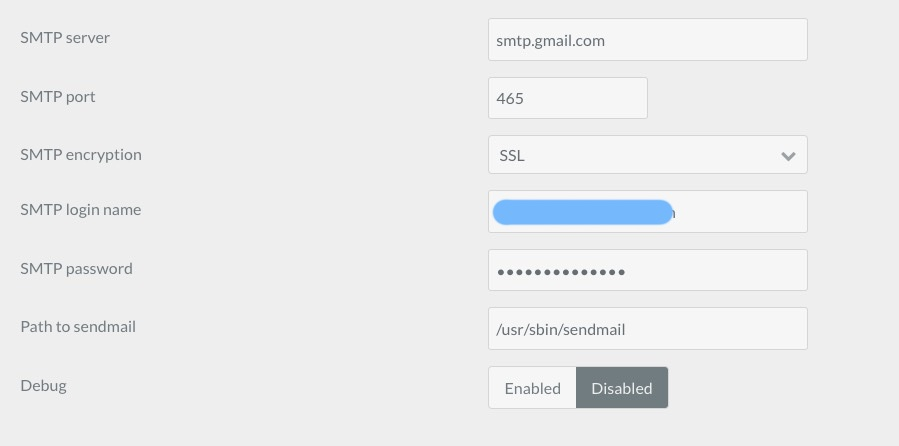

Introduction
-----

Contact forms make it easy for visitors to reach out and contact you. In Grav, this process works a little differently than it does in other content management systems. In this guide, we'll outline how you can customize and configure a contact form for your website.

Getting Started
-----

We do recommend using a RocketLauncher to start with. We've done a lot of the initial setup work for you and all you need to do is plug in your email address, and if you'd like, customize the fields you'd like your contact form to have.

If you are using a RocketLauncher, there is a contact form already set up and ready to go. You just need to edit the email address you'd like to have submissions sent to.

Configuring Email
-----

By default the **Email** plugin uses `Sendmail` or PHP Mail to send email. This doesn't work in all cases. You would be better served by switching the **Mail Engine** setting to **SMTP** and configuring your preferred email provider.

We have provided detailed guides for numerous major email providers in the **Email** [plugin documentation](https://github.com/getgrav/grav-plugin-email/blob/develop/README.md). However, for simplicity, we'll go over setting up Google's email (gmail) in this plugin.

Customizing Fields
-----

>> This guide is useful for folks using the RocketLauncher. If you want a full from-scratch tutorial on creating a contact form, check out [Grav's documentation](https://learn.getgrav.org/forms/forms/example-form).

If you would like to customize the fields that appear in your form, you can do so by navigating to Admin > Pages > Form > Contact Form and selecting Expert in the administrator. Here, you'll see the YAML breakdown of the contact form. It will look similar to the fields below.

~~~ .yaml
title: Contact Form
form:
  fields:
    name:
      type: text
      label: Name
      validate:
        required: true
        message: Please enter your name!
    email:
      type: text
      label: Email
      validate:
        type: email
        required: true
        message: Please enter your email address!
    subject:
      type: text
      label: Subject
      validate:
        required: true
        message: Please enter a subject for your message!
    message:
      type: textarea
      label: Message
      validate:
        required: true
        min: 10
        message: Email message needs to be more than 10 characters long!
  buttons:
    submit:
      type: submit
      value: Send Email
  process:
    email:
      from: "{{ form.value.email }}"
      to: "{{ config.plugins.email.to }}"
      subject: "[Contact] {{ form.value.subject|raw }}"
      body: "{{ form.value.message }}  {{ form.value.name }} {{ form.value.email }}"
    message: 'Thank you from contacting us!'
    display: /form/thankyou
~~~

Everything you need to concentrate on takes place within the fields area of this text. You can add or remove fields here. You can find a complete guide on doing this in [Grav's documentation](https://learn.getgrav.org/forms/forms/example-form).

Setting Up Mail
-----

### Google Email

A popular option for sending email is to simply use your Google Accounts SMTP server. To set this up you will need to do 2 things first:

1.  Enable IMAP in your **Gmail Settings** -> **Forwarding and POP/IMAP** -> **IMAP Access**
2.  Enable Less secure apps in your [user account settings](https://myaccount.google.com/lesssecureapps).
3.  If you have 2-factor authentication, you will need to create a unique application password to use rather than your personal password

>> If you attempt to send a message before turning less secure apps on in your [user account settings](https://myaccount.google.com/lesssecureapps), you will need to manually remove your server from the blocked list in your [security dashboard](https://myaccount.google.com/security).

Then configure the **Email** plugin:

#### Administrator

The first option is doing this through the tools available in the administrator. Simply navigate to **Plugins > Email** and do the following:

* Switch the **Mail Engine** setting to **SMTP**.
* Scroll down to **SMTP Server** and enter `smtp.gmail.com`.
* Enter `465` as the **SMTP port**.
* Select `SSL` as the **SMTP Encryption**.
* Enter your login name (typically your email address) in the **SMTP Login Name** field.
* Enter your Google Mail password in the **SMTP Password** field.

#### YAML

If you prefer to configure your email plugin manually using YAML files, here is the `mailer` section of the configuration you can apply.

~~~ .yaml
mailer:
  engine: smtp
  smtp:
    server: smtp.gmail.com
    port: 465
    encryption: ssl
    user: 'YOUR_GOOGLE_EMAIL_ADDRESS'
    password: 'YOUR_GOOGLE_PASSWORD'
~~~

>> NOTE: Check your email sending limits: [https://support.google.com/a/answer/166852?hl=en](https://support.google.com/a/answer/166852?hl=en)>

Troubleshooting
-----

### Emails are not sent

#### Debugging

The first step in determining why emails are not sent is to enable debugging. This can be done via the `user/config/email.yaml` file or via the plugin settings in the admin. Just enable this and then try sending an email again. Then inspect the `logs/email.log` file for potential problems.

#### ISP Port 25 blocking

By default, when sending via PHP or Sendmail the machine running the webserver will attempt to send mail using the SMTP protocol. This uses port 25 which is often blocked by ISPs to protected against spamming. You can determine if this port is blocked by running this command in your temrinal (mac/linux only):

~~~ .php
(echo >/dev/tcp/localhost/25) &>/dev/null && echo "TCP port 25 opened" || echo "TCP port 25 closed"
~~~

If it's blocked there are ways to configure relays to different ports, but the simplest solution is to use SMTP for mail sending.

#### Exceptions

If you get an exception when sending email but you cannot see what the error is, you need to enable more verbose exception messages. In the `user/config/system.yaml` file ensure your have the following configuration:

~~~ .yaml
errors:
  display: 1                                    
  log: true 
~~~

#### Configuration Issues

As explained above in the Configuration section, if you're using the default settings, set the Plugin configuration to use a SMTP server. It can be Gmail or another SMTP server you have at your disposal.

This is the first thing to check. The reason is that PHP Mail, the default system used by the Plugin, is not 100% reliable and emails might not arrive.
