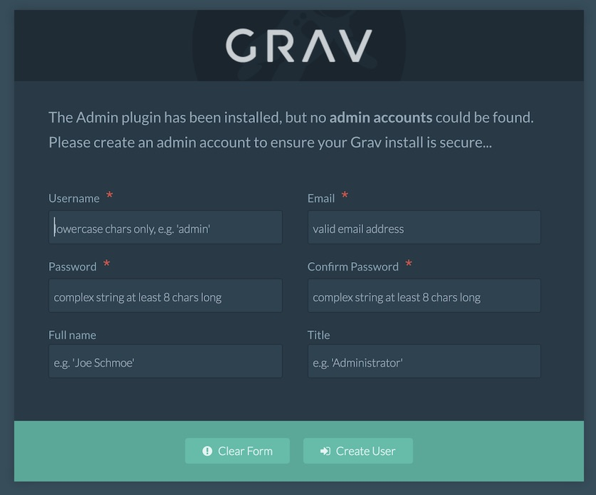

## Introduction

RocketTheme's RocketLaunchers are the quickest and easiest way to hit the ground running with a new Grav website. This guide will help you get started using a RocketLauncher from RocketTheme.

## Requirements

RocketLauncher comes complete with its own copy of Grav and any required plugins. All you need to provide is the server the site will be hosted on. Here is a list of our recommended requirements for any updated RocketLauncher package.

* PHP 5.5.9 or higher

Not all packages are the same, so we recommend checking with the theme's primary documentation to make sure your setup matches its recommended requirements.

## Installing RocketLauncher

The first step you will want to take whenever installing a Grav RocketLauncher is to download the RocketLauncher file from [RocketTheme.com](http://rockettheme.com). Any other source is likely to be outdated and unsupported.

Once you have downloaded this ZIP file, unpack it so you have a folder containing the Grav installation files and folders. The contents of this folder will then need to be placed in your site's root directory via FTP or your host's preferred upload method. Wherever you place this folder's contents will become the root directory for your site.

### Set Up Your Site

After uploading the RocketLauncher to your site's root directory, you are ready to begin installation. To launch the installer, just go to your site's root URL. For example, if your Grav blog is located at `http://example.com/`, use your browser to go to that URL and the first page that appears should look like the image above.

Here, you will need to set up the administrative user account for your site as well as the publicly-facing name and title for that account. Here is a quick breakdown of the fields you can fill out on this page.

* **Username**: Here you will enter the single name (in lowercase letters) you would like to use when you log in to your site's administrator.
* **Email**: This will be the email address you want associated with the administrator account. This is important for password recovery and other email communication.
* **Password**: This will be the password for the primary administrator account. It must contain at least one lowercase and uppercase letter, one number, and at least 8 characters.
* **Confirm Password**: Repeat the password used in the **Password** field.
* **Full Name**: This would be the full name of your administrator account to be displayed publicly. This field is optional.
* **Title**: You can assign your account a publicly-facing title here.

In this screen, you will select your site's title, administrative username and password, as well as the administrative email address used to send you information regarding your site. Once this information is filled out, you need to select **Create User** to complete installation and log in for the first time.

You can find more information about this process in Grav's [official documentation](https://learn.getgrav.org/admin-panel/introduction#creating-a-user).
