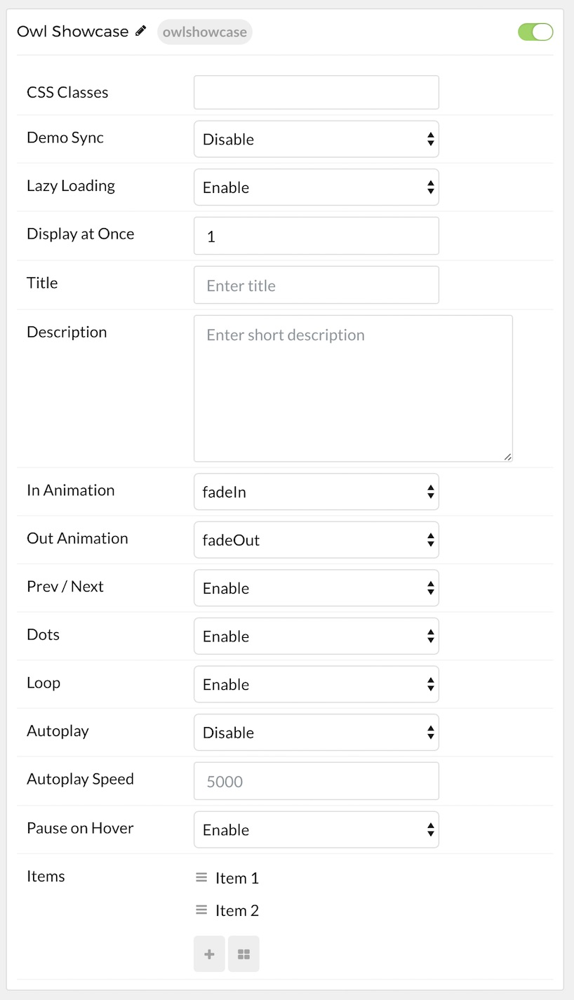
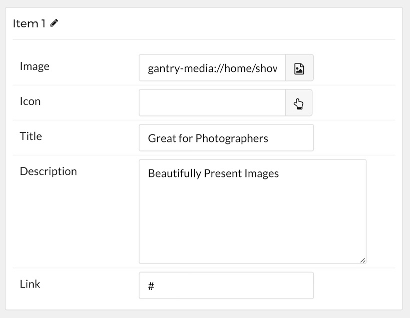

## Introduction

The **Owl Showcase** particle is a diverse particle with multiple layouts, a wide range of features and customization options.

The **Owl Showcase** particle is based on the open source project of the same name by [Bartosz Wojciechowski](http://www.owlcarousel.owlgraphic.com/index.html).

Here are the topics covered in this guide:

* [Configuration](#configuration)
    - [Main Options](#main-options)
    - [Item Options](#item-options)

## Configuration

The settings panel for **Owl Showcase** is filled with options, bells, and whistles you can use to configure your particle. Here is a quick breakdown of the settings you will find in this particle in Acronym.

### Main Options 

| Option          | Description                                                                                                                                  |
| :-----          | :-----                                                                                                                                       |
| CSS Classes     | Sets the CSS class for the content of the particle.                                                                                          |
| Demo Sync       | **Enable** or **Disable** sync with demo presets.                                                                                            |
| Lazy Loading    | **Enable** or **Disable** the loading of images as they are needed rather than all at once.                                                  |
| Display at Once | Determines how many items are displayed at a given time in the particle.                                                                     |
| Title           | Sets the title of the particle, as it will appear on the front end.                                                                          |
| Description     | s you to enter a description for the particle. This is independent of individual item descriptions.                                          |
| In Animation    | Sets the animation type as content is brought in. `fadeIn` is a popular option.                                                              |
| Out Animation   | Sets the animation type as content is removed on the front end. `fadeOut` is a popular option.                                               |
| Prev Next       | Enables a previous / next switcher on the front end.                                                                                         |
| Prev Text       | Allows you to set text that appears in the Previous switch on the front end.                                                                 |
| Next Text       | Allows you to set text that appears in the Next switch on the front end.                                                                     |
| Dots            | Enables or disables pagination dots.                                                                                                         |
| Loop            | Enables or disables looping of content, going from finish to start continuously.                                                             |
| Autoplay        | Enables or disables autoplay, allowing the particle to automatically move through items.                                                     |
| Autoplay Speed  | Sets the speed at which items are automatically progressed in autoplay.                                                                      |
| Pause on Hover  | Pauses the automatic switching between items in autoplay.                                                                                    |

### Item Options

| Option                        | Description                                                                                                                    |
| :-----                        | :-----                                                                                                                         |
| Owl Showcase Item Name        | Sets the name for the item in the carousel. This is only seen on the back end.                                                 |
| Owl Showcase Item Image       | Enables you to define an image for the item. This is the primary image that appears most prominently as the item is displayed. |
| Owl Showcase Item Icon        | You can use this field to assign an icon to the item that appears with its **Title**. For example: `fa fa-cogwheel fa-fw`.     |
| Owl Showcase Item Title       | Enter a title for the item here.                                                                                               |
| Owl Showcase Item Description | This is the main content body of the item. Enter any information you want to have displayed in paragraph form here.            |
| Owl Showcase Item Link        | This is where you would enter a link you want the item to send visitors to when clicked.                                       |

