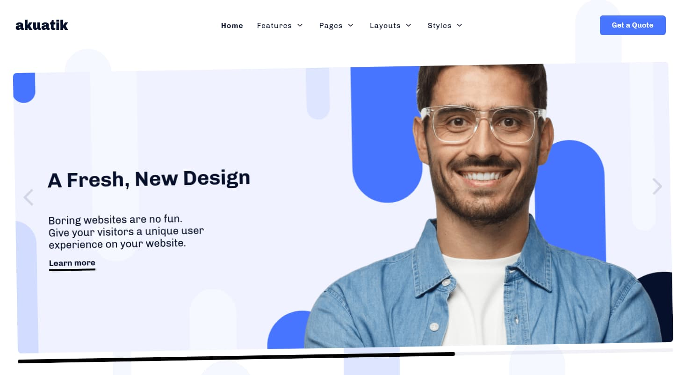

Introduction
-----

Akuatik is a stylishly modern, professional theme that approaches web design from a different angle. Eye-catching visuals, subtle animations, and a bold new look will draw visitors' attention to what's important to your brand.

Requirements
-----

* PHP 7.1+
* Curl
* OpenSSL Libraries
* Multibyte String Support

>> NOTE: Gantry v5.4.26+ is required for Akuatik to work correctly. For more details on the Gantry Framework, please visit its [Dedicated Website](http://gantry.org).

Key Features
-----

### Included Particles

* Block Content
* Branding
* Button
* Category List
* Copyright
* Custom HTML
* Date
* Featured Videos
* Grav Content
* Grid Statistic
* Heading
* Image Grid
* Info List
* Latest News
* Logo / Image
* Logos
* Menu
* Mobile Menu
* Newsletter
* Particles
* Popup Module
* Pricing Table
* Promo
* Search
* Simple Content
* Simple Counter
* Simple Menu
* Slideshow
* Social
* Team
* Testimonials
* To Top
* Topic List
* Video 

### Theme Features

* Responsive Layout
* 3 Preset Styles
* Particles JS
* Custom Typography
* Unlimited Positions
* Custom Particles
* Mobile Menu
* Coming Soon Page
* Font Awesome Icons 

### Gantry Core Features

* YAML-based Configuration
* Twig Templating
* Powerful Particle System
* Visual Menu Editor
* MegaMenu Support
* Off-Canvas Panel
* Ajax Admin
* Layout Manager
* Theme Inheritance
* Fluid Width Option
* Fixed Width Option
* SCSS Support
* Sophisticated Fields
* Unlimited Undo/Redo
* Styles Panel

## Typography

Typography is an important instrument in not only the site design, but how your content is portrayed and utilized by your visitors. Therefore, Akuatik offers a rich selection of elegant typography to provide focus to varying content types.

## Responsive

Akuatik is a responsive theme which means it adapts to the viewing device's width, such as mobile, tablet or desktop. Mobile modes have a unique menu to aid usability. Support classes can also be used to display or hide various types of content for each device.

## Inheritance

Akuatik takes full advantage of Gantry’s new inheritance system, making it easier than ever to configure and manage your website through synced particles, atoms, sections, and layouts. Save time by using inheritance to avoid repetitive changes!
