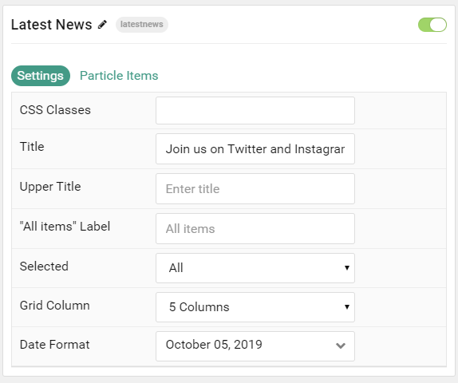

## Introduction

The **Latest News** particle displays your latest articles or featured content, along with images and text. You can vary the way these items appear, making them more appealing to the eye and magazine-like.

Here are the topics covered in this guide:

* [Configuration](#configuration)
    - [Main Options](#settings)
    - [Item Options](#particle-item-options)

## Configuration

### Settings

These options affect the main area of the particle, and not the individual items within.

| Option          | Description                                                                                         |
|:--------------- |:--------------------------------------------------------------------------------------------------- |
| Particle Name   | This is the name of the particle used for back end management. It does not appear on the front end. |
| CSS Classes     | Enter any CSS class(es) you wish to have apply to the particle.                                     |
| Title           | Set a title for the particle.                                                                       |
| Upper Title     | Enter a title to appear above the main title.                                                       |
| All Items Label | Enter a text label to bring up all items regardless of category.                                    |
| Selected        | Choose the selected nav item by default.                                                            |
| Grid Column     | Set the number of columns items appear in.                                                          |
| Date Format     | Select the date format to be displayed.                                                             |

### Particle Item Options

These items make up the individual featured items in the particle.

| Option        | Description                                                                               |
| :-----------  | :---------------------------------------------------------------------------------------- |
| Item Name     | This is the name of the item. This appears as the item's title on the front end.          |
| Color Variant | Select between **Light**, **Medium**, and **Dark** color variants for the item.           |
| Layout        | Choose between **Photo**, **Photo Large**, and **Text** as the layout type for the item.  |
| Date          | Enter a date for the article.                                                             |
| Image         | Set an image to appear in the item.                                                       |
| Description   | Enter a text description for the item.                                                    |
| URL           | Enter a URL you would like the item to link to.                                           |
| Target        | Select a target window for the URL to open through.                                       |

