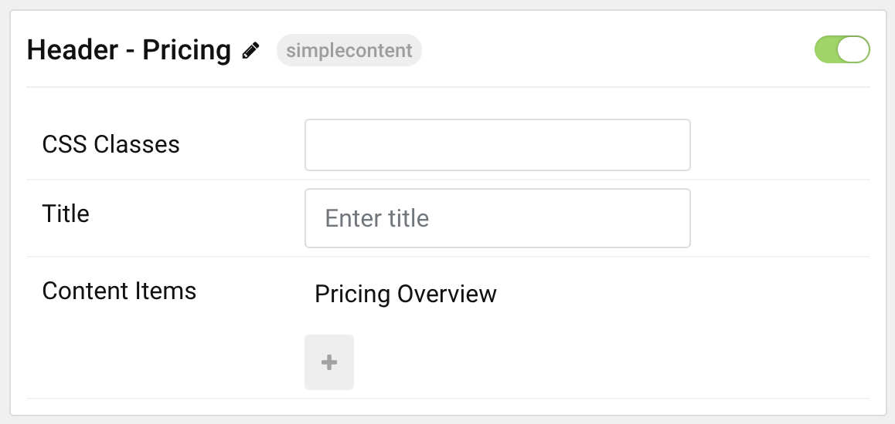

## Introduction

The **Simple Content** particle enables you quickly and easily add one or more simple blocks of content to your page. The image above shows four Simple Content particles. One sitting in a row above the other three.

Here are the topics covered in this guide:

* [Configuration](#configuration)
    - [Main Options](#main-options)
    - [Item Options](#item-options)

## Configuration

### Main Options 

These options affect the main area of the particle, and not the individual items within.

| Option        | Description                                                                                 |
| :-----        | :-----                                                                                      |
| Particle Name | Enter the name you would like to assign to the particle. This only appears in the back end. |
| CSS Classes   | Enter the CSS class(es) you want to use in the content of the particle.                     |
| Title         | Enter a title for the particle.                                                             |

### Item Options

These items make up the individual featured items in the particle.

| Option            | Description                                                                                                      |
| :-----            | :-----                                                                                                           |
| Item Name         | Enter the name you would like to assign to the item. This only appears in the back end.                          |
| Layout Style      | Select the style of layout you would like to have used for the item. You can choose: **Header** or **Standard**. |
| Created Date      | Set the created date for the item.                                                                               |
| Content Title     | Enter a title for the item. This appears at the top of the item in the particle.                                 |
| Author            | Enter an author's name for the item.                                                                             |
| Leading Content   | Enter leading content for the item.                                                                              |
| Main Content      | Enter main content for the item.                                                                                 |
| Read More Label   | Enter text you would like to have appear as the read more link.                                                  |
| Read More Link    | Enter the URL you would like the read more link to go to.                                                        |
| Read More Classes | Enter any CSS classes you would like to have apply to the read more link.                                        |
| Target            | Set the target for the read more link. This can be set to **Self** or **New Window**.                            |

