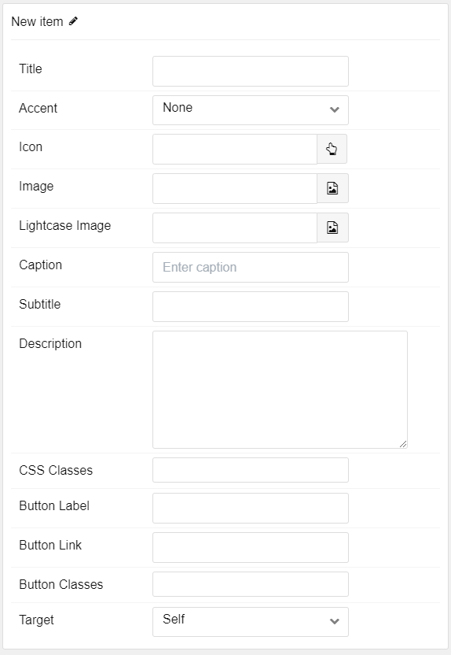

## Introduction

The **Block Content** particle is a great way to create a clean and simple content block with images and text. 

Here are the topics covered in this guide:

- [Introduction](#introduction)
- [Configuration](#configuration)
  - [Main Options](#main-options)
  - [Item Options](#item-options)

## Configuration

### Main Options 

These options affect the main area of the particle, and not the individual items within. For example, if you want to display content that includes a title, headline, image, and link you can do so here, but if you want to display numerous individual items, each with their own text, images, and/or links, you can do so using the **Block Items** collection feature.

| Option         | Description                                                                                                                 |
| :------------- | :-------------------------------------------------------------------------------------------------------------------------- |
| Image          | Set a main image that appears separate from any Block Item images.                                                          |
| Headline       | Enter a headline you want to appear on the front end.                                                                       |
| Description    | Enter the text you wish to have appear as the description for the particle. This text appears below the title and headline. |
|                |
| Button Label   | Enter a label to appear in the button.                                                                                      |
| Button Link    | The URL you want the item to link to.                                                                                       |
| Button Classes | Enter any CSS class(es) you want to have apply to the button.                                                               |
| Target         | Select the target window the button link will open in.                                                                      |

### Item Options

These items make up the individual featured items in the particle. They sit apart from the particle's title, headline, image, and description. Each item can have its own properties, including images and written content.

| Option          | Description                                                                          |
| :-------------- | :----------------------------------------------------------------------------------- |
| Title           | Enter the title for the block item.                                                  |
| Accent          | Select an accent color to appear in the item.                                        |
| Icon            | Select the icon you would like to have appear with the title area in the block item. |
| Image           | Select the image you would like to have displayed with the item.                     |
| Lightcase Image | Choose an image to appear when expanded into a lightcase.                            |
| Caption         | Caption the image here.                                                              |
| Subtitle        | Add a subtitle for the item here.                                                    |
| Description     | Enter a description for the item here, appears as paragraphed text.                  |
| CSS Classes     | Enter any CSS classes you would like to have apply just to this item.                |
| Button Label    | Enter a label to appear in the button.                                               |
| Button Link     | The URL you want the item to link to.                                                |
| Button Classes  | Enter any CSS class(es) you want to have apply to the button.                        |
| Target          | Select the target window the button link will open in.                               |
