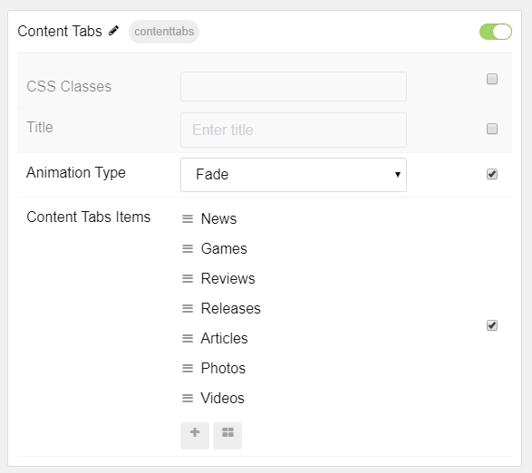

## Introduction

The **Content Tabs** particle lets you display an abundance of different categories of content in a small space using tabs.

Here are the topics covered in this guide:

- [Introduction](#introduction)
- [Configuration](#configuration)
  - [Main Options](#main-options)
  - [Item Options](#item-options)

## Configuration

### Main Options

These options affect the main area of the particle, and not the individual items within.

| Option         | Description                                                                     |
| :------------- | :------------------------------------------------------------------------------ |
| CSS Classes    | Set the CSS class(es) you would like to have apply at the particle level.       |
| Title          | Enter the title of the particle you would like to have appear on the front end. |
| Animation Type | Set the type of animation that plays when tabs are switched.                    |

### Item Options

These items make up the individual featured items in the particle.

| Option         | Description                                              |
| :------------- | :------------------------------------------------------- |
| Name           | This is the name of the tab, appearing on the front end. |
| Read More Text | Enter text to appear in the read more button.            |
| Read More Link | Enter a URL the icon will send visitors to.              |
| Tab Content    | Enter text/HTML content for the item.                    |
