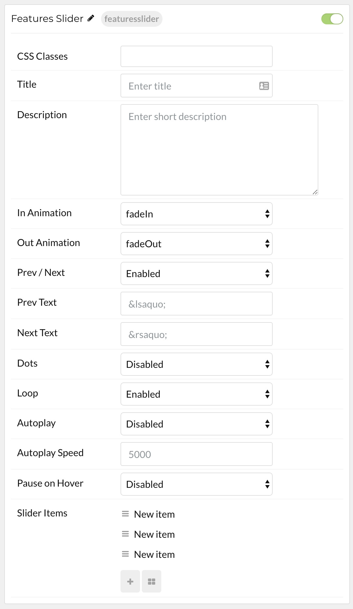

## Introduction

The **Simple Content** particle makes it easy to create smooth, modern sliders for your website.

Here are the topics covered in this guide:

* [Configuration](#configuration)
    - [Main Options](#main-options)
    - [Item Options](#item-options)

## Configuration

### Main Options 

These options affect the main area of the particle, and not the individual items within.

| Option         | Setting                                                               |
| :-----         | :-----                                                                |
| Particle Name  | The name of the particle for organizational use in the backend.       |
| CSS Classes    | CSS Class(es) you would like to have apply to the particle's content. |
| Title          | Title of the particle as it will appear on the front end.             |
| Description    | Enter a text description for the particle.                            |
| In Animation   | Select an animation for items coming in.                              |
| Out Animation  | Select an animation for items going out.                              |
| Prev / Next    | Enable or Disable the presence of previous / next buttons.            |
| Prev Text      | Enter any text you want to appear as the previous button.             |
| Next Text      | Enter any text you want to appear as the next button.                 |
| Dots           | Enable or Disable the presence of navigation dots.                    |
| Loop           | Enable or Disable looping of items.                                   |
| Autoplay       | **Enable** or **Disable** autoplay for the particle.                  |
| Autoplay Speed | Set the speed (in milliseconds) of the particle's animation.          |
| Pause on Hover | **Enable** or **Disable** the pause-on-hover effect for the particle. |

### Item Options

These items make up the individual featured items in the particle.

| Option       | Description                                                       |
| :-----       | :-----                                                            |
| Name         | Enter a name for your item. This only appears on the back end.    |
| Image        | Set an image for the item.                                        |
| Title        | Enter a title for the item.                                       |
| Description  | Enter a description for the item.                                 |
| Link         | Enter a link for the item.                                        |
| Link Text    | Enter text that appears as the link for the item.                 |
| Target       | Select between **Self** and **New Window** for the link's target. |
| Button Class | Insert and CSS class(es) you want to have apply to the button.    |

