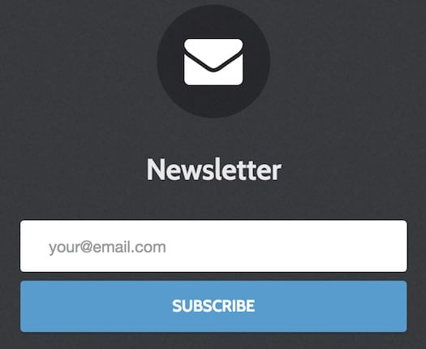

## Introduction

The **Newsletter** particle enables users to sign up for your newsletter. You need to create an account on <a href="https://mailchimp.com/" target="_blank">MailChimp.com</a> and copy the form embed action url into the particle's Form Action URL input field.

Here are the topics covered in this guide:

* [Configuration](#configuration)
    - [Main Options](#main-options)

## Configuration

### Main Options 

| Option          | Description                                                                             |
| :-----          | :-----                                                                                  |
| Form Action URL | MailChimp Embedded Forms URL.                                                           |
| CSS Classes     | Set the CSS class(es) you would like to have apply at the particle level.               |
| Width           | Choose the width of the particle. Choices include: **Full** and **Compact**.            |
| Layout          | Select a layout style for the particle. **Stack** and **Aside** are available.          |
| Style           | Choose between **Rounded** and **Square** for the Input Box and Button.                 |
| Title           | Add a title to your particle that will appear on the front end.                         |
| Heading Text    | An extra line for text.                                                                 |
| InputBox Text   | Enter text you wish to appear in the input box users will enter their email address in. |
| Button Text     | Add text to your submit button.                                                         |
| Button Classes  | Enable CSS class(es) in your submit button.                                             |
