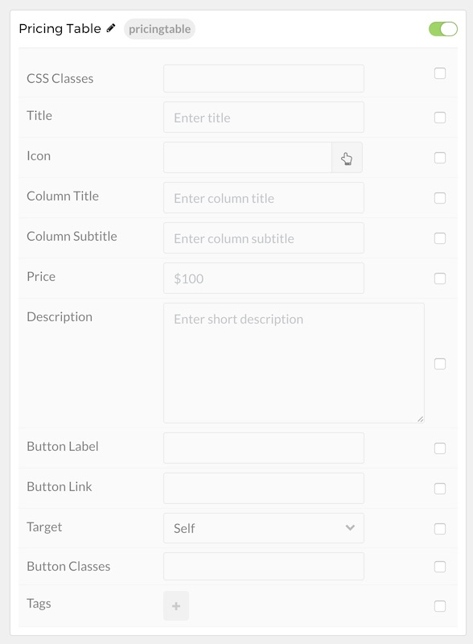
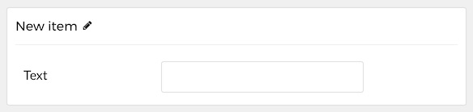

## Introduction

The **Pricing Table** particle is a simple particle that enables you to create clean, organized comparison tables. This is a perfect addition to any website featuring tiered products and/or services.

Here are the topics covered in this guide:

* [Configuration](#configuration)
    - [Main Options](#main-options)
    - [Item Options](#item-options)

## Configuration

### Main Options 

These options affect the main area of the particle, and not the individual items within.

| Option          | Description                                                                               |
| :-----          | :-----                                                                                    |
| Particle Name   | Sets the name for the particle that appears on the back end.                              |
| CSS Classes     | Enter any CSS class(es) that you would like to have apply to the particle's content here. |
| Title           | Enter a title here that will appear on the front end.                                     |
| Icon            | Enter an icon that appears near the title.                                                |
| Column Title    | Enter the column title text.                                                              |
| Column Subtitle | Enter the column subtitle text.                                                           |
| Price           | Set a price for the product or service represented by this column.                        |
| Description     | Enter a description for the product or service represented by the column.                 |
| Button Label    | Enter a button label.                                                                     |
| Button Link     | Enter the link that takes the user to the product or service page.                        |
| Target          | Enter a browser target for the link.                                                      |
| Button Classes  | Enter any class(es) you wish to have apply to the button.                                 |

### Item Options

Items in this particle are the tags for this column.

| Option | Description                       |
| :----- | :-----                            |
| Text   | Enter text to appear in the item. |
