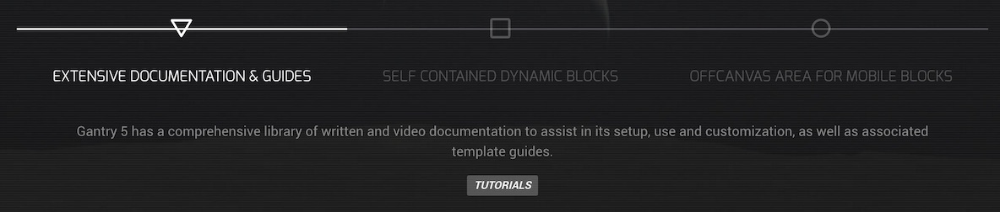
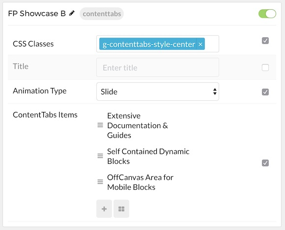
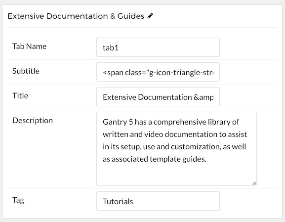

## Introduction

The **Content Tabs** particle displays content in elegant, easy-to-navigate tabs.

Here are the topics covered in this guide:

* [Configuration](#configuration)
    - [Main Options](#main-options)
    - [Item Options](#item-options)

## Configuration

### Main Options 

These options affect the main area of the particle, and not the individual items within. You can set the title of the particle, as well as give it an introductory paragraph here.

| Option         | Description                                                                                         |
| :-----         | :-----                                                                                              |
| Particle Name  | This is the name of the particle used for back end management. It does not appear on the front end. |
| CSS Classes    | Enter any CSS class(es) you wish to have apply to the particle.                                     |
| Title          | Enter a title for the particle. This will appear on the front end.                                  |
| Animation Type | You can choose between transition animation types here.                                             |

### Item Options

These items make up the individual featured items in the particle. They sit apart from the particle's title and introduction. Each item can have its own properties, including icons and written content.

| Option      | Description                                                                 |
| :-----      | :-----                                                                      |
| Item Name   | This is the name of the item. This only appears in the back end.            |
| Tab Name    | Each item needs a unique tab name. This is for organizational purpose only. |
| Subtitle    | Enter a subtitle for the tab that appears on the front end.                 |
| Title       | Enter a title to appear on the front end.                                   |
| Description | Descriptive text goes here. This is the bulk of the item's content.         |
| Tag         | Add tag(s) to the item                                                      |