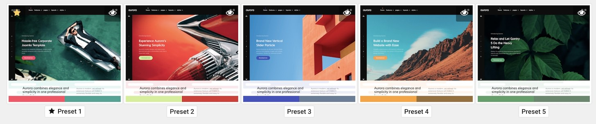

Theme Style Settings
-----

One of the most important aspects of any Gantry theme is its ability to be easily customized using the settings presets in the Theme Settings page. These settings can be adjusted by navigating to **Administration -> Gantry 5**. To replicate the demo, the styling changes are being made in the **Styles** tab.

Most of the settings under **Styles** are adjusted automatically with the selection of a theme preset. You can set presets using the **Presets** options located at the top of the **Styles** admin panel.

Once you have selected a Preset, these options can be further adjusted to match the demo. Keep in mind that the Style indicated here relates to the theme Style in this menu. More information about how Styles work can be found in our [Gantry documentation](http://docs.gantry.org/gantry5/configure/styles).

In Aurora's demo, we went with **Preset 1**. 
