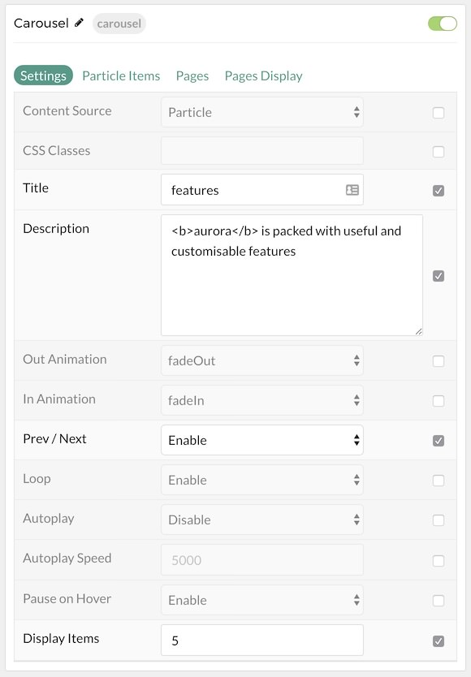
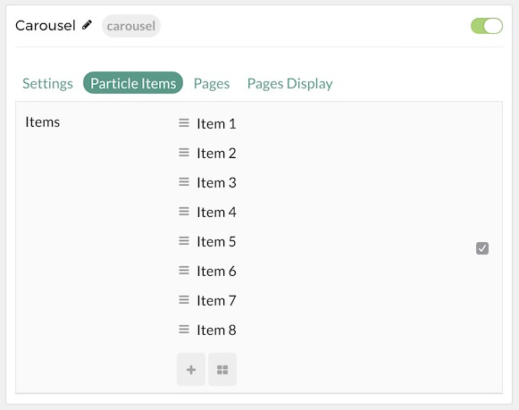
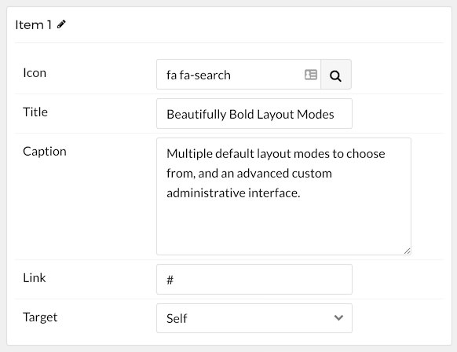
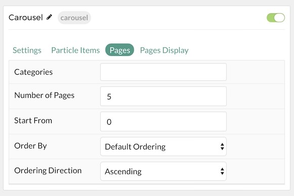
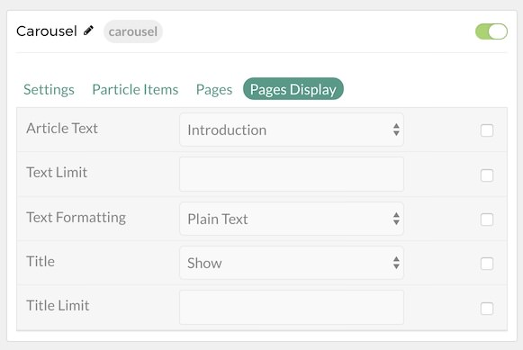

## Introduction

The **Carousel** particle displays images in a side-scrolling carousel that can be easily dragged left or right by touch or with a click of the mouse. This particle enables you to populate content either manually or directly from the CMS.

Here are the topics covered in this guide:

* [Configuration](#configuration)
    - [Main Options](#settings)
    - [Item Options](#particle-item-options)
    - [Pages](#posts)
    - [Display](#display)

## Configuration

### Settings 

These options affect the main area of the particle, and not the individual items within. You can set the title of the particle, as well as give it an introductory paragraph here.

| Option         | Description                                                                                         |
| :-----         | :-----                                                                                              |
| Particle Name  | This is the name of the particle used for back end management. It does not appear on the front end. |
| Content Source | Choose between **Particle** and **Grav** as the Content Source.                                   |
| CSS Classes    | Enter any CSS class(es) you wish to have apply to the particle.                                     |
| Title          | Enter a title for the particle. This will appear on the front end.                                  |
| Description    | Enter a description for the particle to appear on the front end.                                    |
| Out Animation  | Set the type of animation that runs when a testimonial is going out.                                |
| In Animation   | Set the type of animation that runs when a testimonial is coming in.                                |
| Prev / Next    | **Enable** or **Disable** the prev / next navigation.                                               |
| Loop           | **Enable** or **Disable** looping of items.                                                         |
| Autoplay       | **Enable** or **Disable** autoplay.                                                                 |
| Autoplay Speed | Enter (in milliseconds) the delay between automatic switching between items.                        |
| Pause on Hover | **Enable** or **Disable** pausing of autoplay on hover.                                             |
| Display Items  | Select the number of items to display in the carousel.                                              |

### Particle Item Options

These items make up the individual featured items in the particle. Items in this section will only appear if **Particle** is selected as the **Content Source**.

| Option    | Description                                                      |
| :-----    | :-----                                                           |
| Item Name | This is the name of the item. This only appears in the back end. |
| Icon      | Select a Font Awesome icon for the item.                         |
| Caption   | Enter a text caption for the item.                               |
| Link      | Enter a URL you would like the item to link to.                  |
| Target    | Choose the target tab you would like the URL to open to.         |

### Pages

| Option             | Description                                                                            |
| :-----             | :-----                                                                                 |
| Categories         | Select the categories of pages this particle will display.                             |
| Number of Pages    | Enter the maximum number of pages to display.                                          |
| Start From         | Enter offset specifying the first page to return. The default is '0' (the first page). |
| Order By           | Choose the type of factor to order by.                                                 |
| Ordering Direction | Choose between **Ascending** and **Descending** as the page ordering method.           |

### Display

This section configures how pages are displayed.

| Option             | Description                                                                |
| :-----             | :-----                                                                     |
| Content Type       | Choose between **Content**, **Excerpt**, and **Hide** as the content type. |
| Content Limit      | Set a limit (in characters) for the content being displayed.               |
| Content Formatting | Choose between HTML and Plain Text content formatting.                     |
| Title              | Choose to Show or Hide the title.                                          |
| Title Limit        | Set a limit (in characters) for the title being displayed.                 |
