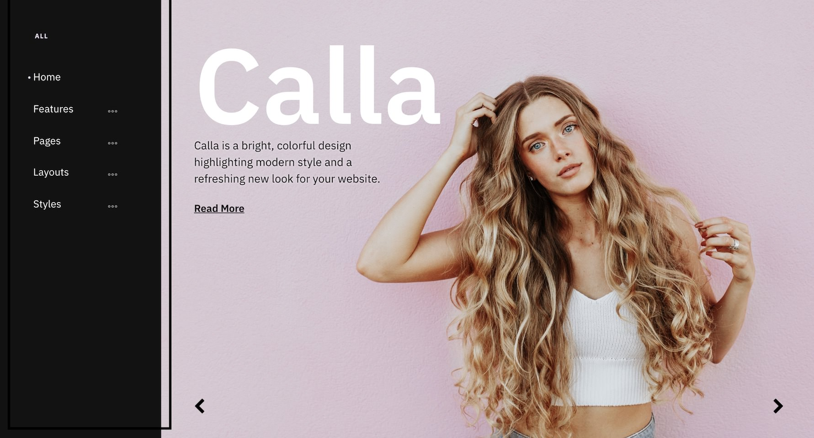
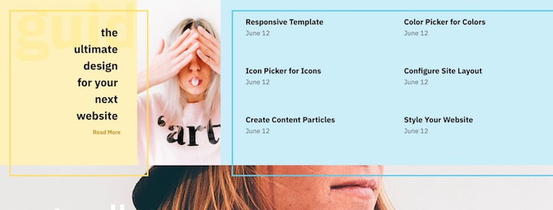

Introduction
-----

Calla is a fresh, bold design built on the powerful, state-of-the-art Gantry 5 framework and packed with exclusive and professional designed particles that make it a dream to work with on a host of different websites from fashion blogs to tech startups.

New to Gantry 5?
-----
If you are new to Gantry 5, a good place to start would be our [dedicated Gantry documentation](http://docs.gantry.org).

Requirements
-----

* PHP 7.1+
* Curl
* OpenSSL Libraries
* Multibyte String Support

>> NOTE: Gantry 5.4.22+ is required for Calla to work correctly. For more details on the Gantry Framework, please visit its [Dedicated Website](http://gantry.org).

Key Features
-----

### Included Particles

* Block Content
* Branding
* Carousel
* Case Studies
* Copyright
* Custom HTML
* Date
* Grav Content
* Grid Statistic
* Heading
* Image Grid
* Info List
* Logo / Image
* Menu
* Mobile Menu
* Newsletter
* Pricing Table
* Promo
* Search
* Simple Content
* Simple Counter
* Simple Menu
* Slider
* Slideshow
* Social
* Springboard
* To Top
* Vertical Menu
* Video 

### Theme Features

* Responsive Layout
* 3 Preset Styles
* Custom Typography
* Unlimited Positions
* Custom Particles
* Mobile Menu
* Coming Soon Page
* Font Awesome Icons 

### Gantry Core Features

* YAML-based Configuration
* Twig Templating
* Powerful Particle System
* Visual Menu Editor
* MegaMenu Support
* Off-Canvas Panel
* Ajax Admin
* Layout Manager
* Theme Inheritance
* Fluid Width Option
* Fixed Width Option
* SCSS Support
* Sophisticated Fields
* Unlimited Undo/Redo
* Styles Panel

## Typography

Typography is an important instrument in not only the site design, but how your content is portrayed and utilized by your visitors. Therefore, Calla offers a rich selection of elegant typography to provide focus to varying content types.

## Responsive

Calla is a responsive theme which means it adapts to the viewing device's width, such as mobile, tablet or desktop. Mobile modes have a unique menu to aid usability. Support classes can also be used to display or hide various types of content for each device.

## Inheritance

Calla takes full advantage of Gantry’s new inheritance system, making it easier than ever to configure and manage your website through synced particles, atoms, sections, and layouts. Save time by using inheritance to avoid repetitive changes!
