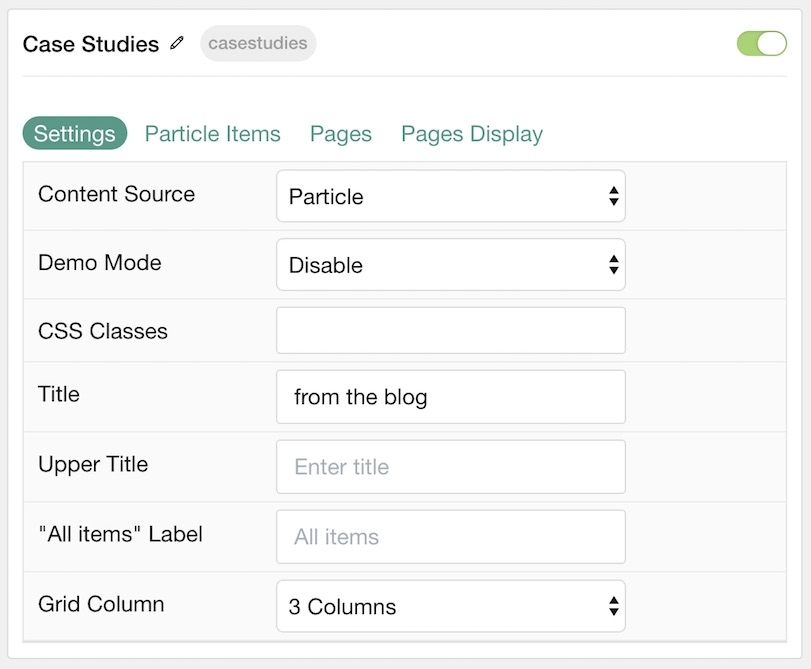
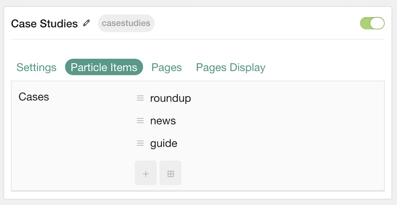
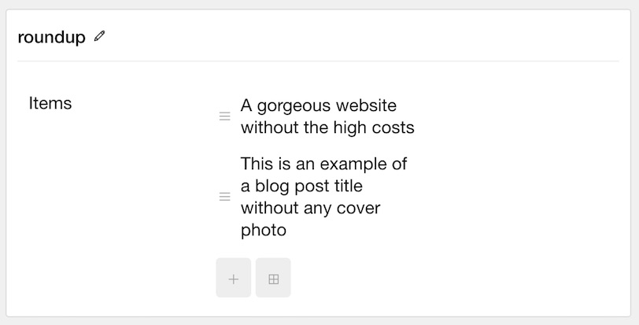
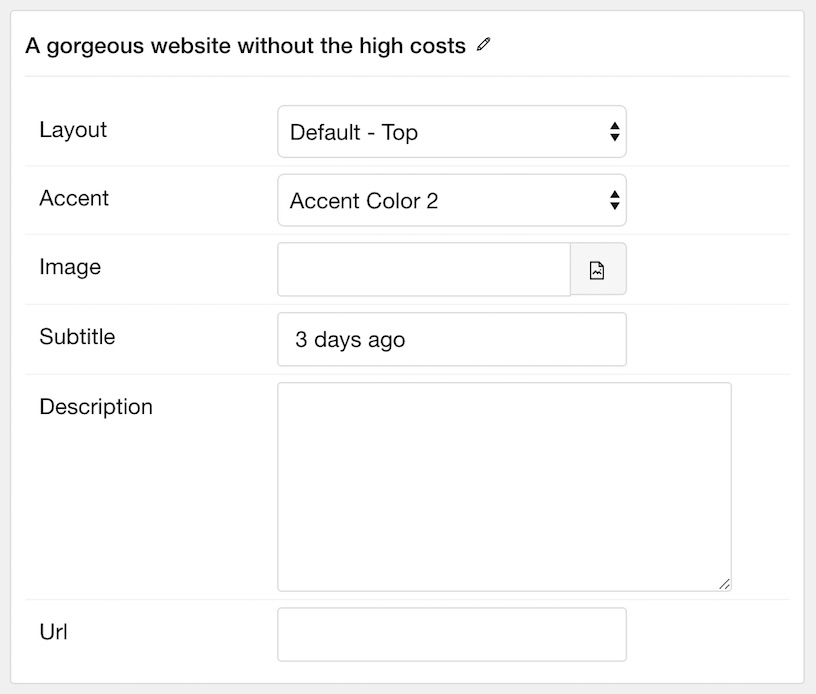
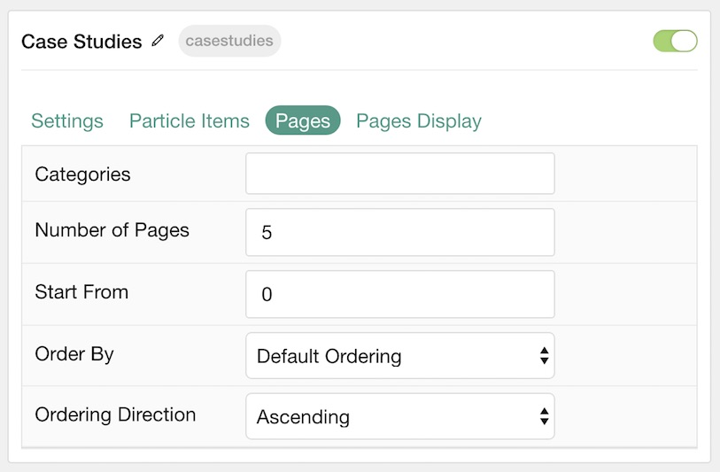
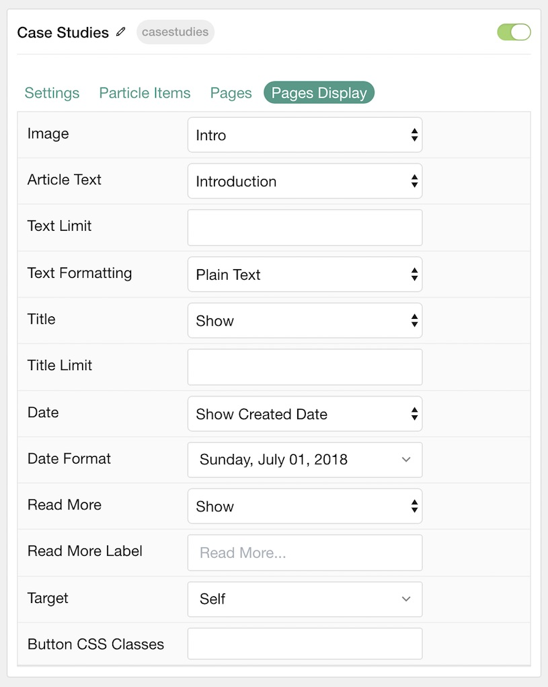

## Introduction

The **Case Studies** particle is an excellent particle for displaying image content in a clean, modern way.

Here are the topics covered in this guide:

* [Configuration](#configuration)
    - [Main Options](#settings)
    - [Item Options](#particle-item-options)
    - [Pages](#pages)
    - [Display](#display)

## Configuration

### Settings 

These options affect the main area of the particle, and not the individual items within. You can set the title of the particle, as well as give it an introductory paragraph here.

| Option            | Description                                                                                             |
| :-----            | :-----                                                                                                  |
| Particle Name     | This is the name of the particle used for back end management. It does not appear on the front end.     |
| Content Source    | Choose between **Particle** and **Grav** as the Content Source.                                    |
| Demo Mode         | **Enables** or **Disables** Demo Mode. If enabled the preset number will be synced with the set number. |
| CSS Classes       | Enter any CSS class(es) you wish to have apply to the particle.                                         |
| Title             | Enter a title for the particle. This will appear on the front end.                                      |
| Upper Title       | Enter a title to appear in the upper area of the particle.                                              |
| "All Items" Label | Enter a label for the tab that loads all of the items at once.                                          |
| Grid Column       | Enter the number of column(s) you wish to have items displayed in at once.                              |

### Particle Item Options

These items make up the individual featured items in the particle. Items in this section will only appear if **Particle** is selected as the **Content Source**.

| Option      | Description                                                           |
| :-----      | :-----                                                                |
| Item Name   | This is the name of the item. This only appears in the back end.      |
| Accent      | Select the accent color from the style settings to apply to the item. |
| Image       | Select an image to display in the item.                               |
| Subtitle    | Enter a subtitle to appear with the item.                             |
| Description | Enter a text description to appear with the item.                     |
| URL         | Enter a URL for the item to link to.                                  |

### Pages

| Option             | Description                                                                            |
| :-----             | :-----                                                                                 |
| Categories         | Select the categories of pages this particle will display.                             |
| Number of Pages    | Select the number of pages you would like the particle to fetch.                       |
| Start From         | Enter offset specifying the first post to return. The default is '0' (the first post). |
| Order By           | Choose the type of factor to order by.                                                 |
| Ordering Direction | Choose between **Ascending** and **Descending** as the post ordering method.           |

### Display

This section configures how posts are displayed.

| Option             | Description                                                                                        |
| :-----             | :-----                                                                                             |
| Image              | Display the image assigned to the post's **Featured Image**. Choose between **Hide** and **Show**. |
| Content Type       | Choose between **Content**, **Exerpt**, and **Hide**.                                              |
| Content Limit      | Set a limit (in characters) for the article text displayed.                                        |
| Content Formatting | Choose between **HTML** and **Plain Text** formatting for the post's text.                         |
| Title              | **Show** or **Hide** the post's title.                                                             |
| Title Limit        | Enter the maximum number of characters in the title to display.                                    |
| Date               | Choose to show the **Created**, **Published**, **Modified**, or to **Hide** the date.              |
| Date Format        | Select the format you wish to have the date displayed in.                                          |
| Read More          | **Show** or **Hide** the Read More link.                                                           |
| Read More Label    | Enter a text label to appear as the read more link                                                 |
| Target             | Set a target window for the read more link.                                                        |
| Button CSS Classes | Enter any CSS Class(es) to apply to the items.                                                     |