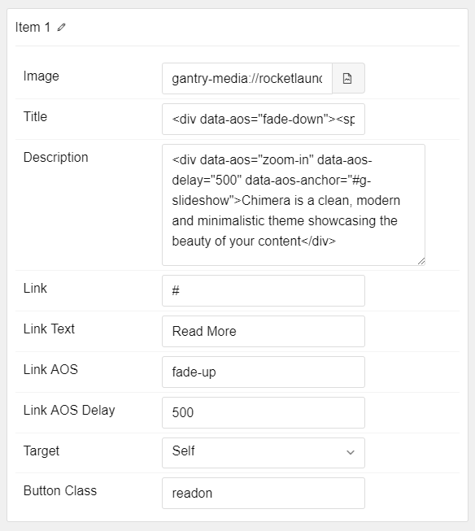

## Introduction

The **Slideshow** particle makes it easy to create smooth, modern sliders for your website.

Here are the topics covered in this guide:

* [Configuration](#configuration)
    - [Main Options](#main-options)
    - [Item Options](#item-options)

## Configuration

### Main Options 

These options affect the main area of the particle, and not the individual items within.

 

| Option         | Setting                                                               |
| :-----         | :-----                                                                |
| Particle Name  | The name of the particle for organizational use in the backend.       |
| CSS Classes    | CSS Class(es) you would like to have apply to the particle's content. |
| Description    | A text description to appear on the front end for the particle.       |
| In Animation   | Select the type of animation to use for incoming slides.              |
| Out Animation  | Select the type of animation to use for outgoing slides.              |
| Prev Next      | Enable or Disable the Prev/Next Buttons.                              |
| Dots           | Enable or Disable navigation dots.                                    |
| Loop           | Enable or Disable looping of slides.                                  |
| Autoplay       | **Enable** or **Disable** autoplay for the particle.                  |
| Autoplay Speed | Set the speed (in milliseconds) of the particle's animation.          |
| Pause on Hover | **Enable** or **Disable** the pause-on-hover effect for the particle. |
| To Bottom      | **Enable** or **Disable** the icon sending users to the next section. |

### Item Options

These items make up the individual featured items in the particle.

| Option         | Description                                                                           |
| :-----         | :-----                                                                                |
| Name           | Enter a name for your item. This only appears on the back end.                        |
| Image          | Set an image for the item.                                                            |
| Title          | Enter a title for the item.                                                           |
| Description    | Enter a description for the item.                                                     |
| Link           | Enter a link for the item.                                                            |
| Link Text      | Enter text that appears as the link for the item.                                     |
| Link AOS       | Select the animation-on-scroll type for the Link                                      |
| Link AOS Delay | Enter (in milliseconds) the delay for the scroll.                                     |
| Target         | Select between **Self** and **New Window** for the link's target.                     |
| Button Class   | Enter any CSS class(es) you wish to use for the button. We used `readon` in our demo. |