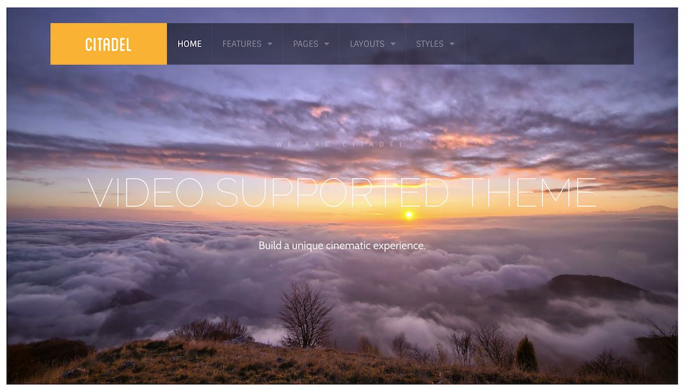

Introduction
-----

Citadel brings your site to life with integrated support for YouTube, Vimeo, and locally-hosted MP4, WebM, Mov, and Ogg videos. Citadel also provides a clean design that ensures that your content is exactly where it needs to be, center stage.

Requirements
-----

* PHP 7.1 or higher
* Grav 1.1.9+

>> NOTE: Gantry v5.4.1+ is required for Citadel to work correctly. For more details on the Gantry Framework, please visit its [Dedicated Website](http://gantry.org).

Key Features
-----

* Responsive Layout
* Video Support
* 6 Preset Styles
* Block Variations
* Custom Typography
* Unlimited Positions
* Popup Module
* Custom Particles
* Social Icons
* Mobile Menu
* Coming Soon Page
* Font Awesome Icons 
* YAML-based Configuration
* Twig Templating
* Powerful Particle System
* Visual Menu Editor
* MegaMenu Support
* Off-Canvas Panel
* Ajax Admin
* Layout Manager
* Theme Inheritance
* Fluid Width Option
* Fixed Width Option
* SCSS Support
* Sophisticated Fields
* Unlimited Undo/Redo
* Styles Panel

## Inheritance

Citadel takes full advantage of Gantry’s new inheritance system, making it easier than ever to configure and manage your website through synced particles, atoms, sections, and layouts. Save time by using inheritance to avoid repetitive changes.

## Typography

Typography is an important instrument in not only the site design, but how your content is portrayed and utilized by your visitors. Therefore, Citadel offers a rich selection of elegant typography to provide focus to varying content types.

## Responsive

Citadel is a responsive theme which means it adapts to the viewing device's width, such as mobile, tablet or desktop. Mobile modes have a unique menu to aid usability. Support classes can also be used to display or hide various types of content for each device.
