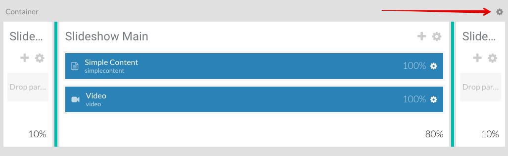
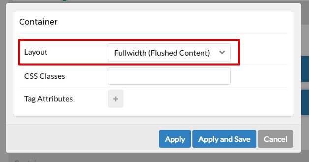
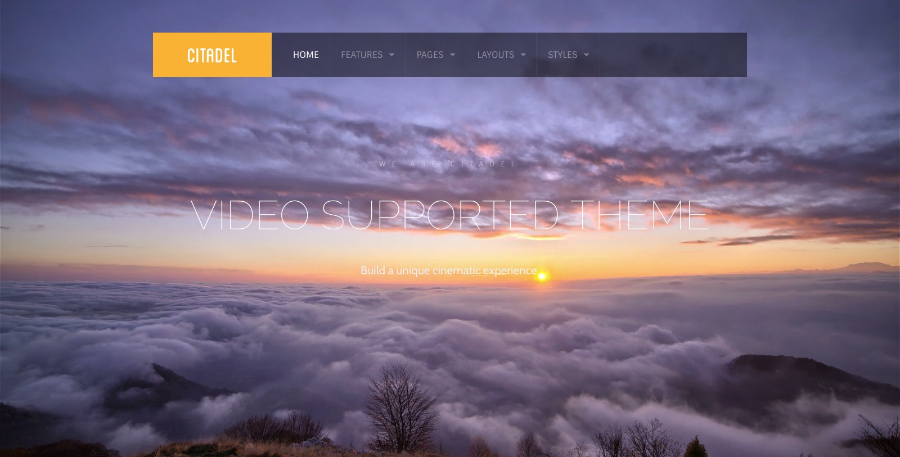

When you first load our Citadel theme, you will see on your Home page that our Video Particle is contained within a surrounding background. 

In this tutorial, we want to show you how to easily display your Video in FullWidth (so that it extends to the entire width of your screen).

Let's start by making our way to your Home Outline > Layout > Slideshow and select the Cog icon for the Container.

Then in the Layout dropdown, select Fullwidth (Flushed Content) and then select Apply.

Next, select the Cog icon for both Slideshow Left and Slideshow Right.

Select the 'Block' tab and **uncheck** the Fixed Size option for Slideshow Left and Slideshow Right and then select Apply.

Once this is done, select the Save Layout button at the top or bottom of the screen.

Return to your frontend and refresh the Home Page, you should now see that your video extends to the entire width of the screen!

If you have any questions / issues regarding this tutorial or Citadel in general, please begin a New Topic [here](http://www.rockettheme.com/forum/grav-theme-citadel).