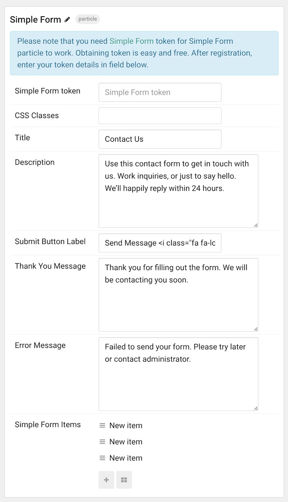

## Introduction

The **Simple Form** particle is a great way to create a clean and simple content block with images and text. 

Here are the topics covered in this guide:

* [Layout](#layout)
    - [Particle Content](#particle-content)
* [Configuration](#configuration)
    - [Main Options](#main-options)
    - [Item Options](#item-options)

## Layout

Simple Form items have a simple, yet robust layout that enables you to add a lot of different types of content in a single item. Each item spans both sides - or pages if you prefer - of the particle's layout. There is, of course, a difference in how this content is sourced depending on whether you are using items created in the particle's settings panel, or from the CMS.

### Particle Content

:   1. **Particle - Title** [5%, 5%, se]
    2. **Particle - Description** [15%, 5%, se]
    3. **Particle - Submit Button Label** [90%, 3%, se]
    4. **Item - Label** [40%, 3%, se]
    5. **Item - Placeholder** [48%, 3%, se]

## Configuration

### Main Options 

These options affect the main area of the particle, and not the individual items within. For example, if you want to display content that includes a title, headline, image, and link you can do so here, but if you want to display numerous individual items, each with their own text, images, and/or links, you can do so using the **Block Items** collection feature.

| Option              | Description                                                                           |
| :-----              | :-----                                                                                |
| Simple Form token   | Place the Simple Form token here.                                                     |
| CSS Classes         | Add any CSS Classes you wish you have apply to the particle's content here.           |
| Title               | Add a title to your particle.                                                         |
| Description         | Add a description to your particle.                                                   |
| Submit Button Label | Enter text that appears in the Submit button.                                         |
| Thank You Message   | Enter a message that appears after the form has been submitted.                       |
| Error Message       | Enter a message that appears in the event of an error at the time of form submission. |

### Item Options

These items make up the individual featured items in the particle. They sit apart from the particle's title, headline, image, and description. Each item can have its own properties, including images and written content.

| Option                       | Description                                          |
| :-----                       | :-----                                               |
| Label                        | Enter a label for the form field.                    |
| Placeholder                  | Enter placeholder content for the form field.        |
| Required                     | Indicates whether or not the form field is required. |
| Minimum Value (Spinner only) | Used for spinner fields, sets the minimum value.     |
| Maximum Value (Spinner only) | Used for spinner fields, sets the minimum value.     |

