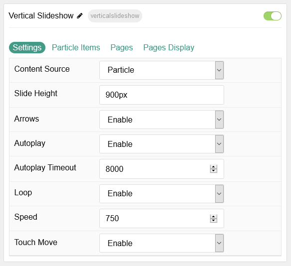
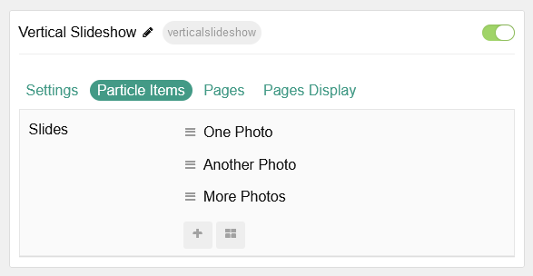
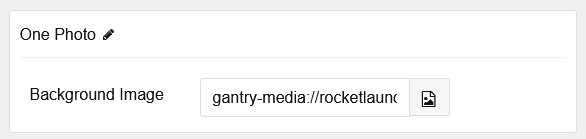
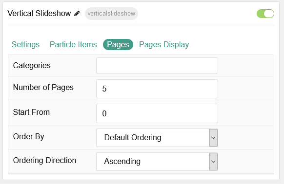
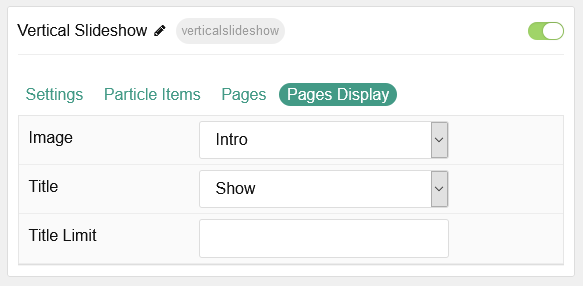

## Introduction

The **Vertical Slideshow** particle enables you to create a beautiful vertically-scrolling slideshow of images.

Here are the topics covered in this guide:

* [Configuration](#configuration)
    - [Main Options](#settings)
    - [Item Options](#particle-item-options)
    - [Pages](#pages)
    - [Display](#display)

## Configuration

### Settings

These options affect the main area of the particle, and not the individual items within.

| Option            | Description                                                                                               |
| :---------------- | :-------------------------------------------------------------------------------------------------------- |
| Particle Name     | This is the name of the particle used for back end management. It does not appear on the front end.       |
| Content Source    | Choose between **Particle** and **Grav** as the content source for the particle.                     |
| Slide Height      | Set the minimal height of each slide.                                                                     |
| Arrows            | **Enable** or **Disable** arrows navigation.                                                              |
| Autoplay          | **Enable** or **Disable** autoplay for the particle.                                                      |
| Autoplay Timeout  | Set the time (in milliseconds) between slides in autoplay mode.                                           |
| Loop              | **Enable** or **Disable** looping slides.                                                                 |
| Speed             | Set the transition speed (in milliseconds).                                                               |
| Touch Move        | **Enable** or **Disable** touch movements.                                                                |

### Particle Item Options

These items make up the individual featured items in the particle. Items in this section will only appear if **Particle** is selected as the **Content Source**.

| Option                  | Description                                                                                                  |
| :---------------------- | :--------------------------------------------------------------------------------------                      |
| Item Name               | This is the name of the item. It is used only for backend organization and does not appear on the front end. |
| Background Image        | Select a background image to appear in the particle.                                                         |

### Pages

| Option             | Description                                                                            |
| :-----             | :-----                                                                                 |
| Categories         | Select the categories of pages this particle will display.                             |
| Number of Pages    | Enter the maximum number of pages to display.                                          |
| Start From         | Enter offset specifying the first page to return. The default is '0' (the first page). |
| Order By           | Choose the type of factor to order by.                                                 |
| Ordering Direction | Choose between **Ascending** and **Descending** as the page ordering method.           |

### Display

This section configures how pages are displayed.

| Option      | Description                                                          |
| :-----      | :-----                                                               |
| Image       | Choose to **Show** or **Hide** the **Featured Image** for each item. |
| Title       | **Show** or **Hide** the page's title.                               |
| Title Limit | Enter the maximum number of characters in the title to display.      |