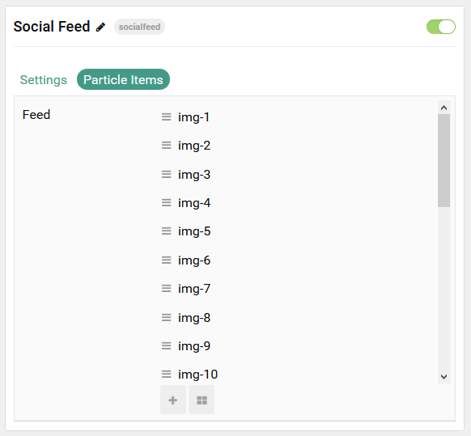

## Introduction

The **Social Feed** particle is used to display images in a grid content sourced either directly from Gantry or [Instagram](https://instagram.com).

Here are the topics covered in this guide:

- [Introduction](#introduction)
- [Configuration](#configuration)
  - [Main Options](#main-options)
  - [Item Options](#item-options)

## Configuration

### Main Options 

These options affect the main area of the particle, and not the individual items within.

| Option                      | Description                                                                                                                                  |
| :-------------------------- | :------------------------------------------------------------------------------------------------------------------------------------------- |
| Particle Name               | Enter the name you would like to assign to the particle. This only appears in the back end.                                                  |
| CSS Classes                 | Enter the CSS class(es) you want to use in the content of the particle.                                                                      |
| Content Source              | Choose between **Particle** and **Instagram** as the content source for the particle.                                                        |
| Title                       | Enter a title for the particle.                                                                                                              |
| Instagram User ID           | If **Instagram** is selected as the content source, enter your user ID here.                                                                 |
| Instagram User Access Token | If **Instagram** is selected as the content source, enter the [user access token](https://www.instagram.com/developer/authentication/) here. |
| Grid Column                 | Enter the number of columns for images to display in.                                                                                        |

Please view the following documentation for setting up the content with Instagram:

* [Getting Started Guide - Token](https://developers.facebook.com/docs/instagram-basic-display-api/getting-started)
* [Obtain Long Lived Access Token](https://developers.facebook.com/docs/instagram-basic-display-api/guides/long-lived-access-tokens)

### Item Options

These items make up the individual featured items in the particle.

| Option    | Description                                                                             |
| :-------- | :-------------------------------------------------------------------------------------- |
| Item Name | Enter the name you would like to assign to the item. This only appears in the back end. |
| Image     | Select the image to appear on the front end.                                            |
| Title     | Enter a title that is displayed when the image is selected and expanded.                |

