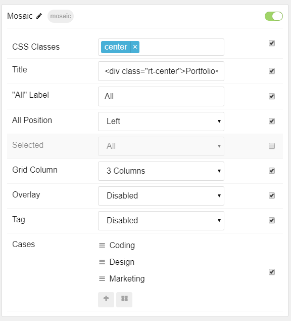

## Introduction

The **Mosaic** is a great way to showcase your site's content.

Here are the topics covered in this guide:

* [Configuration](#configuration)
    - [Main Options](#main-options)
    - [Item Options](#item-options)

## Configuration

### Main Options

These options affect the main area of the particle, and not the individual items within.

| Option        | Setting                                                               |
|:------------- |:--------------------------------------------------------------------- |
| Particle Name | The name of the particle for organizational use in the backend.       |
| CSS Classes   | CSS Class(es) you would like to have apply to the particle's content. |
| Title         | Title of the particle as it will appear on the front end.             |
| All Label     | Enter tha "all items" button label.                                   |
| All Position  | Select the position you want the "all items" filter to appear.        | 
| Selected      | Choose the selected nav item.                                         |
| Grid Column   | Number of column(s) to display content in.                            |
| Overlay       | **Enable** or **Disable** the overlay.                                |
| Tag           | **Enable** or **Disable** tag.                                        |

### Item Options

These items make up the individual featured items in the particle.

| Option         | Description                                                   |
|:-------------- |:------------------------------------------------------------- |
| Name           | Enter a name for your item. This appears on the front end.    |
| Image          | Choose an image to display in the item.                       |
| Title          | Enter a title for the item.                                   |
| Subtitle       | Enter a subtitle for the item.                                |
| Read More Text | Enter text to appear as the read more link.                   |
| URL            | Enter a URL you wish to have the item link to.                |
| Target         | Select a target for the URL.                                  |
| Button Class   | Enter any CSS class(es) you want to have apply to the button. |
