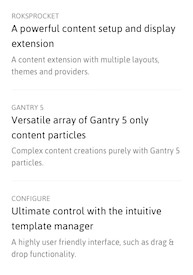
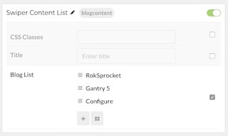

## Introduction

The **Blog Content** particle enables you to easily create and configure listed content items, complete with icons and text.

Here are the topics covered in this guide:

* [Configuration](#configuration)
    - [Main Options](#main-options)
    - [Item Options](#item-options)

## Configuration

### Main Options 

These options affect the main area of the particle, and not the individual items within.

| Option           | Setting                                                               |
| :-----           | :-----                                                                |
| Particle Name    | The name of the particle for organizational use in the backend.       |
| CSS Classes      | CSS Class(es) you would like to have apply to the particle's content. |
| Title            | Title of the particle as it will appear on the front end.             |

### Item Options

These items make up the individual featured items in the particle.

| Option      | Description                                                             |
| :-----      | :-----                                                                  |
| Name        | Enter a name for your item. This only appears on the back end.          |
| Headline    | Enter a headline for the item.                                          |
| Tag         | Enter any tag(s) for the item.                                          |
| Description | Enter a text description for the item.                                  |
| Divider     | Choose between **Bottom**, **Top**, or **None** for the item's divider. |
| Icon Link   | Enter a link for the icon to go to.                                     |
| Icon 1      | Select a first icon for the item.                                       |
| Icon 1 Text | Enter any text you wish to appear with the icon in the item.            |
| Icon 2      | Select a second icon for the item.                                      |
| Icon 2 Text | Enter any text you wish to appear with the icon in the item.            |
| Icon 3      | Select a third icon for the item.                                       |
| Icon 3 Text | Enter any text you wish to appear with the icon in the item.            |