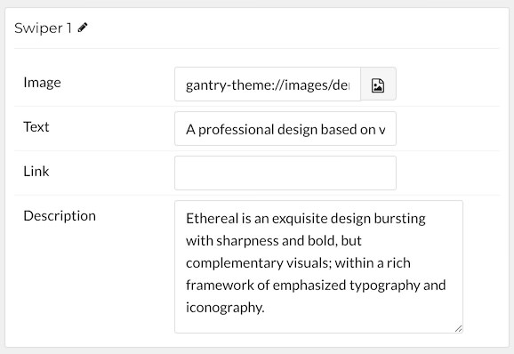

## Introduction

The **Swiper** particle makes it easy to create smooth, modern sliders for your website.

Here are the topics covered in this guide:

* [Configuration](#configuration)
    - [Main Options](#main-options)
    - [Item Options](#item-options)

## Configuration

### Main Options 

These options affect the main area of the particle, and not the individual items within.

| Option           | Setting                                                               |
| :-----           | :-----                                                                |
| Particle Name    | The name of the particle for organizational use in the backend.       |
| CSS Classes      | CSS Class(es) you would like to have apply to the particle's content. |
| Title            | Title of the particle as it will appear on the front end.             |

### Item Options

These items make up the individual featured items in the particle.

| Option      | Description                                                    |
| :-----      | :-----                                                         |
| Name        | Enter a name for your item. This only appears on the back end. |
| Image       | Enter an image for the item.                                   |
| Text        | Enter any text you want to appear with the item.               |
| Link        | Enter the URL you wish to have the link take the user to.      |
| Description | Enter description text for the item.                           |
