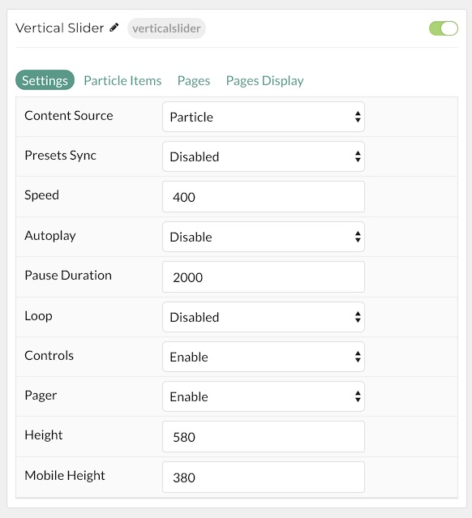
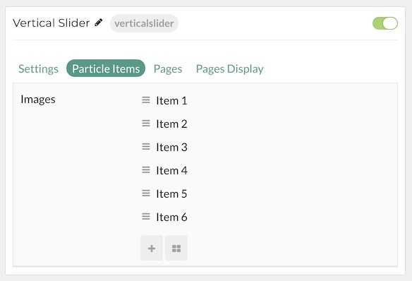
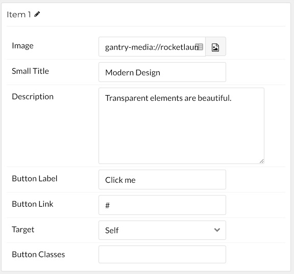
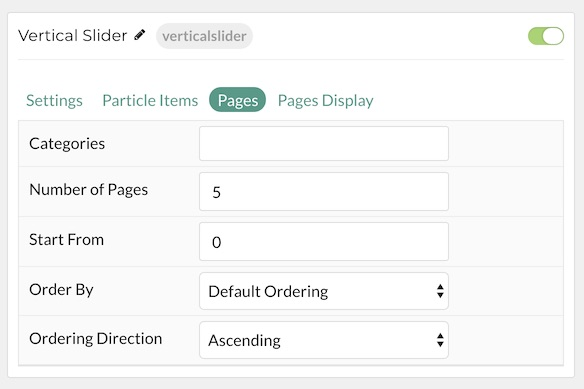
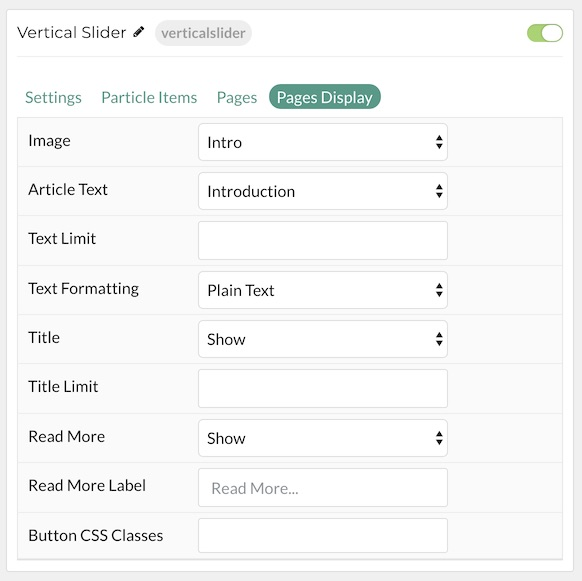

## Introduction

The **Vertical Slider** particle is an excellent way to showcase your featured content on the front page of your website. Content can be added manually or through the CMS.

Here are the topics covered in this guide:

* [Configuration](#configuration)
    - [Main Options](#settings)
    - [Item Options](#particle-item-options)
    - [Articles](#pages)
    - [Display](#display)

## Configuration

### Settings 

These options affect the main area of the particle, and not the individual items within. You can set the title of the particle, as well as give it an introductory paragraph here.

| Option         | Description                                                                                         |
| :-----         | :-----                                                                                              |
| Particle Name  | This is the name of the particle used for back end management. It does not appear on the front end. |
| Content Source | Choose between **Particle** and **Grav** as the Content Source.                                   |
| Transition     | Select a type of transition between items.                                                          |
| Preset Sync    | **Enable** or **Disable** preset synchronization.                                                   |
| Speed          | Enter duration (in milliseconds) of the transition.Height                                           |
| Autoplay       | **Enable** or **Disable** autoplay.                                                                 |
| Loop           | **Enable** or **Disable** looping of items.                                                         |
| Controls       | **Enable** or **Disable** the navigation controls.                                                  |
| Pager          | **Enable** or **Disable** the Pager.                                                                |
| Height         | Set a height for the particle.                                                                      |
| Width          | Set a width for the particle.                                                                       |

### Particle Item Options

These items make up the individual featured items in the particle. Items in this section will only appear if **Particle** is selected as the **Content Source**.

| Option         | Description                                                      |
| :-----         | :-----                                                           |
| Item Name      | This is the name of the item. This only appears in the back end. |
| Image          | Select an image for the item.                                    |
| Small Title    | Enter a small title to appear on the front end.                  |
| Description    | Enter a text description for the item.                           |
| Button Label   | Enter a label to appear on the button.                           |
| Button Link    | Enter a URL you would like the item to link to.                  |
| Target         | Choose the target tab you would like the URL to open to.         |
| Button Classes | Enter any CSS class(es) you wish to have apply to the button.    |

### Pages

| Option             | Description                                                                                  |
| :-----             | :-----                                                                                       |
| Categories         | Select the categories of pages this particle will display.                                   |
| Number of Pages    | Select the number of pages you would like the particle to fetch.                             |
| Start From         | Enter offset specifying the first article to return. The default is '0' (the first article). |
| Order By           | Choose the type of factor to order by.                                                       |
| Ordering Direction | Choose between **Ascending** and **Descending** as the article ordering method.              |

### Display

This section configures how pages are displayed.

| Option             | Description                                                                  |
| :-----             | :-----                                                                       |
| Image              | Display the image assigned to the article's **Intro**, **Full** or **None**. |
| Article Text       | Choose which text to pull from the article.                                  |
| Text Limit         | Set a limit (in characters) of the text to appear in the item.               |
| Text Formatting    | Choose between plain text and HTML as the text format.                       |
| Title              | **Show** or **Hide** the article's title.                                    |
| Title Limit        | Enter the maximum number of characters in the title to display.              |
| Date               | Enter a date for the item.                                                   |
| Date Format        | Select the format you want the date to be displayed in.                      |
| Read More          | **Show** or **Hide** the read more link.                                     |
| Read More Label    | Add a text label for the read more link.                                     |
| Button CSS Classes | Add any CSS class(es) you wish to have apply to the button.                  |