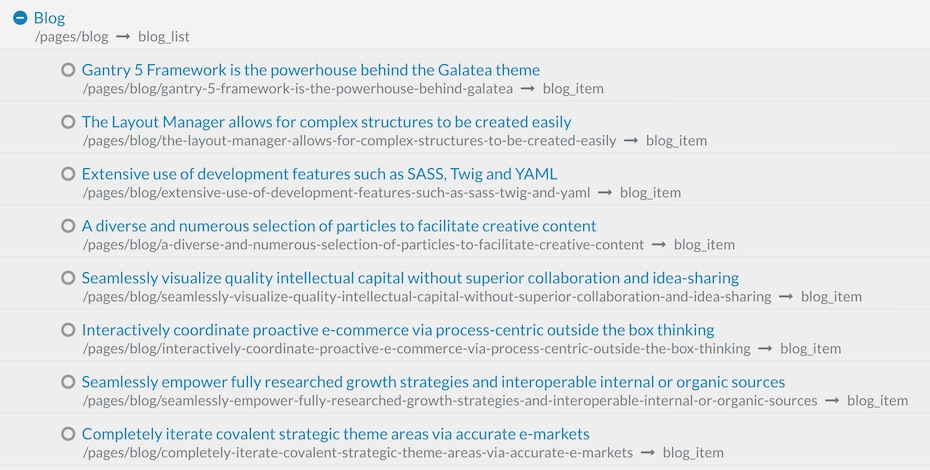
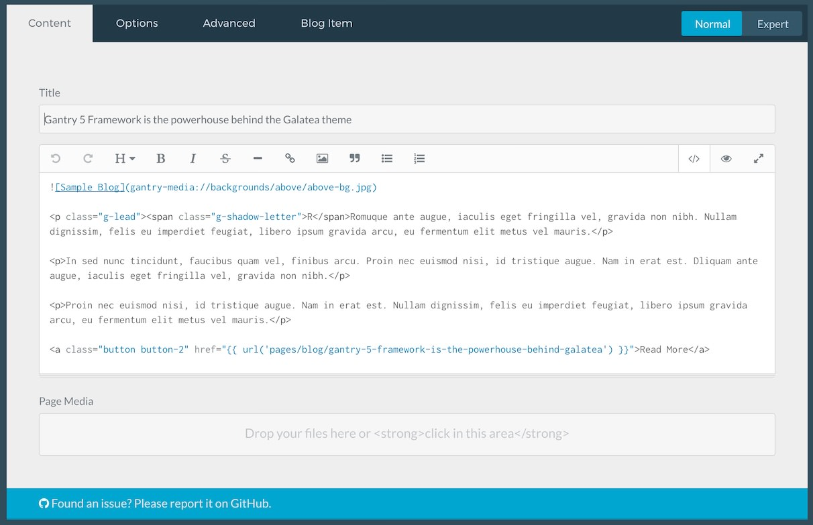
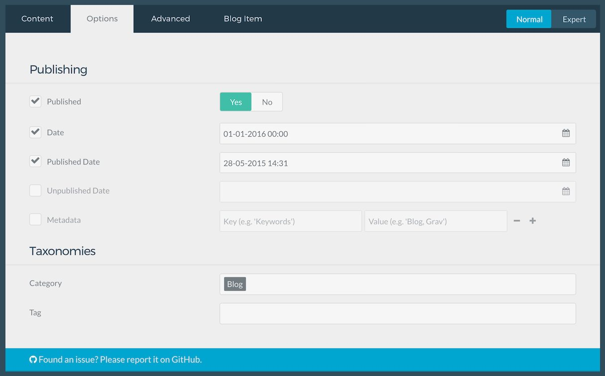
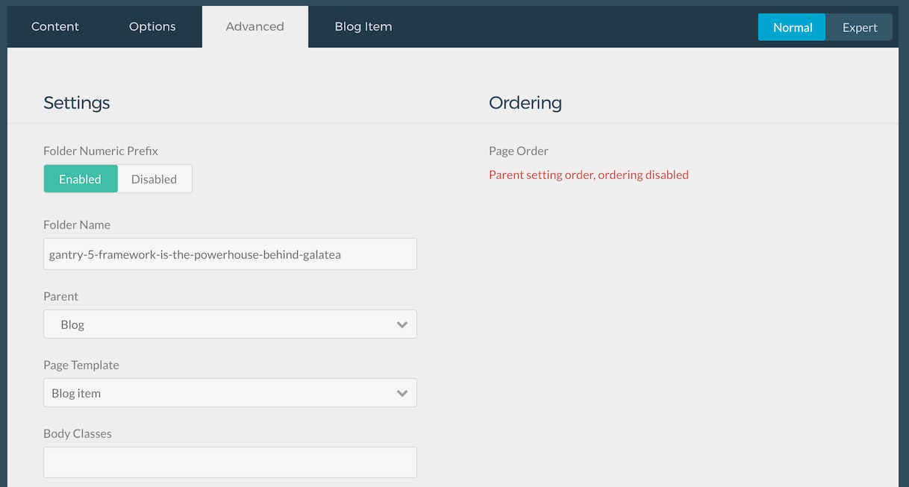

# Introduction

The **Blog** example page demonstrates how you can create a beautiful page with the Galatea theme. Here is some information to help you replicate this page as it appears in the demo.

# Particles

The bulk if this page is made up of **Page Content** generated in the **Mainbar** section.

# Mainbar Section

The **Mainbar** section includes several posts assigned to the **Blog** category, displayed through the **Page Content** particle. Here are the settings found in the **Gantry 5 Framework is the powerhouse behind the Galatea theme** article.

| Option        | Setting                                                         |
| :-----        | :-----                                                          |
| Title         | `Gantry 5 Framework is the powerhouse behind the Galatea theme` |
| Category      | `Blog`                                                          |
| Parent        | `Blog`                                                          |
| Page Template | Blog item                                                       |
| Process       | Markdown and Twig                                               |

**Content Body**

~~~ .html

RRomuque ante augue, iaculis eget fringilla vel, gravida non nibh. Nullam dignissim, felis eu imperdiet feugiat, libero ipsum gravida arcu, eu fermentum elit metus vel mauris.

In sed nunc tincidunt, faucibus quam vel, finibus arcu. Proin nec euismod nisi, id tristique augue. Nam in erat est. Dliquam ante augue, iaculis eget fringilla vel, gravida non nibh.

Proin nec euismod nisi, id tristique augue. Nam in erat est. Nullam dignissim, felis eu imperdiet feugiat, libero ipsum gravida arcu, eu fermentum elit metus vel mauris.

<a class="button button-2" href="{{ url('pages/blog/gantry-5-framework-is-the-powerhouse-behind-galatea') }}">Read More</a>
~~~
