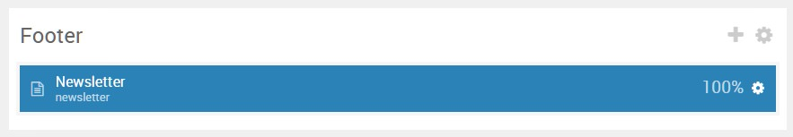

## Introduction

The **Footer** section includes a single **Newsletter** particle.

Here is a breakdown of the widget(s) and particle(s) that appear in this section:

* [Newsletter (particle)](#newsletter-(particle))

## Section Settings

| Option           | Setting                   |
| :--------------- | :----------               |
| Layout           | Fullwidth (Boxed Content) |
| CSS Classes      | Blank                     |
| Tag Attributes   | Blank                     |

## Newsletter (Particle)

### Particle Settings

| Option                | Setting                                     |
| :-----                | :-----                                      |
| Particle Name         | `Newsletter`                                |
| CSS Classes           | `center-block` `g-title-large`              |
| Width                 | Compact                                     |
| Layout                | Aside Wrap                                  |
| Style                 | Rounded                                     |
| Title                 | `Stay Connected`                            |
| Heading Text          | `Subscribe to our weekly newsletter below.` |
| InputBox Text         | `Email Address`                             |
| Button Text           | `Subscribe`                                 |
| Feedburner URI        | `#`                                         |
| Button Classes        | Blank                                       |

### Block Settings

| Option         | Setting   |
| :-----         | :-----    |
| CSS ID         | Blank     |
| CSS Classes    | Blank     |
| Variations     | Blank     |
| Tag Attributes | Blank     |
| Fixed Size     | Unchecked |
| Block Size     | `100%`    |
