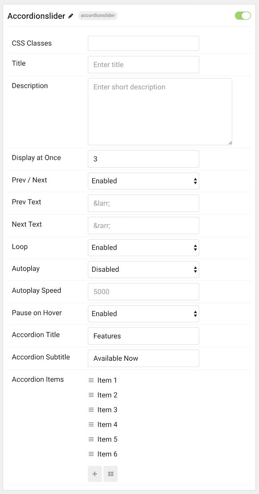
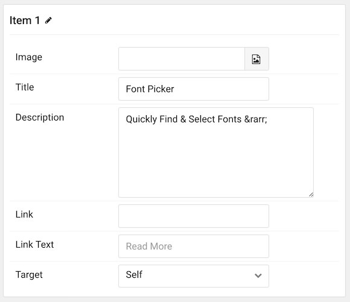

## Introduction

The **Accordion Slider** particle is a clean and easy way to display expandable content in a slider format. This maximizes the amount of content you can put in a limited space. It is a natural and modern part of the Gemini theme.

Here are the topics covered in this guide:

* [Configuration](#configuration)
    - [Main Options](#main-options)
    - [Item Options](#item-options)

### Main Options 

| Option             | Description                                                                                               |
| :-----             | :-----                                                                                                    |
| CSS Classes        | Sets the CSS class for the content of the particle.                                                       |
| Title              | Sets the title of the particle, as it will appear on the front end.                                       |
| Description        | Enables you to enter a description for the particle. This is independent of individual item descriptions. |
| Display at Once    | Determines how many items are displayed at a given time in the particle.                                  |
| Prev Next          | Enables a previous / next switcher on the front end.                                                      |
| Prev Text          | Allows you to set text that appears in the Previous switch on the front end.                              |
| Next Text          | Allows you to set text that appears in the Next switch on the front end.                                  |
| Loop               | Enables or disables looping of content, going from finish to start continuously.                          |
| Autoplay           | Enables or disables autoplay, allowing the particle to automatically move through items.                  |
| Autoplay Speed     | Sets the speed at which items are automatically progressed in autoplay.                                   |
| Pause on Hover     | Pauses the automatic switching between items in autoplay.                                                 |
| Accordion Title    | Customize the accordion title text.                                                                       |
| Accordion Subtitle | Customize the accordion subtitle text.                                                                    |

### Item Options

| Option      | Description                                                               |
| :-----      | :-----                                                                    |
| Image       | Set an image for the item.                                                |
| Title       | Set a title for the item.                                                 |
| Description | Enables you to enter a descriptive paragraph to be displayed in the item. |
| Link        | Set a link for the item to link to.                                       |
| Link Text   | Enter text that appears as the link for the item.                         |
| Target      | Choose a target (self or new window) for the link.                        |