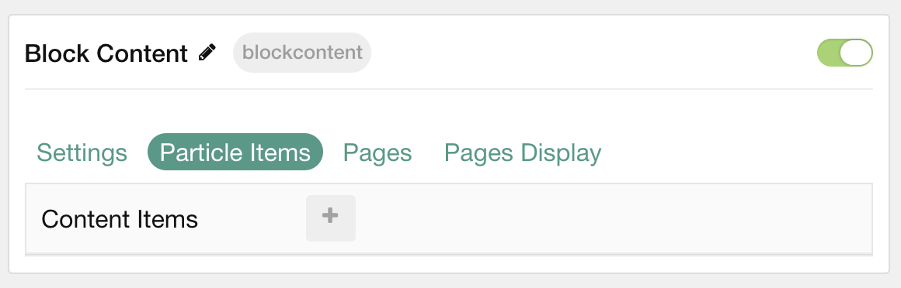
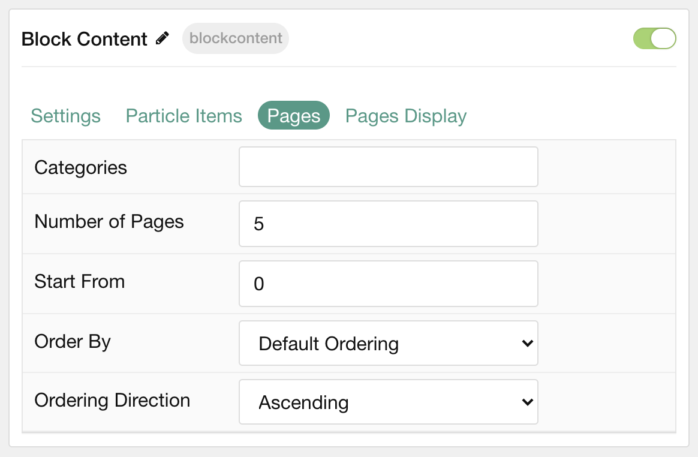
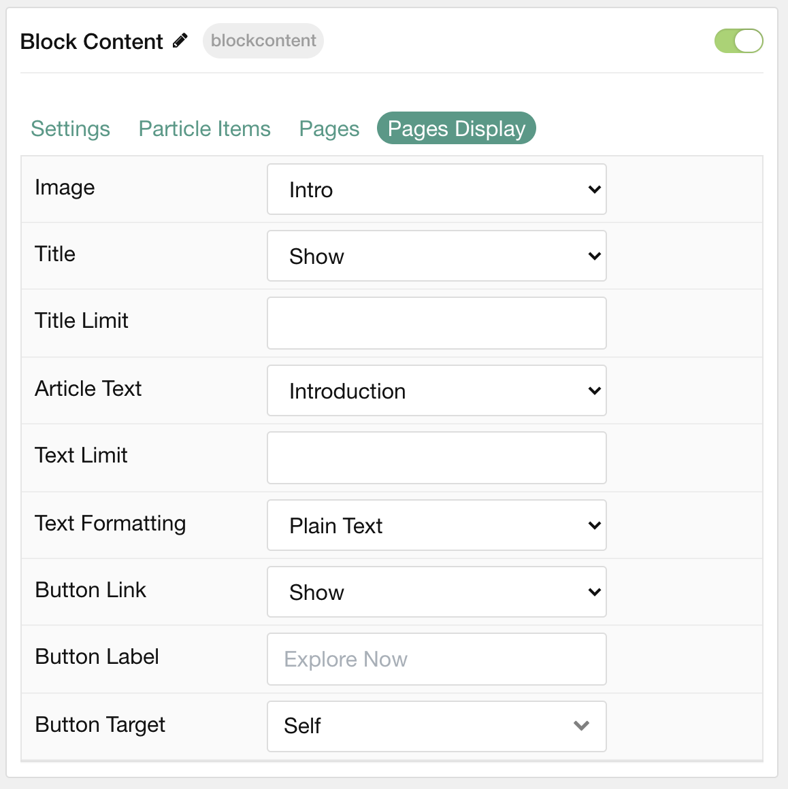

## Introduction

The **Block Content** particle is a great way to create a clean and simple content block with images and text. 

Here are the topics covered in this guide:

- [Introduction](#introduction)
- [Configuration](#configuration)
  - [Settings](#settings)
  - [Particle Item Options](#particle-item-options)
  - [Pages](#pages)
  - [Display](#display)

## Configuration

### Settings 

These options affect the main area of the particle, and not the individual items within.

| Option         | Description                                                                                                                                              |
| :-----         | :-----                                                                                                                                                   |
| Particle Name  | This is the name of the particle used for back end management. It does not appear on the front end.                                                      |
| Content Source | Choose between **Particle** and **Grav** as the Content Source.                                                                                        |
| CSS Classes    | Enter any CSS class(es) you wish to have apply to the particle.                                                                                          |
| Title          | Enter a title for the particle that appears on the front end.                                                                                            |
| Icon           | Set the icon that appears next to the title.                                                                                                             |
| Image          | Set a main image that appears separate from any Block Item images.                                                                                       |
| Headline       | Enter a headline you want to appear on the front end.                                                                                                    |
| Description    | Enter the text you wish to have appear as the description for the particle. This text appears below the title and headline.                              |
| Button Label   | Customize the text you want to have appear in the link button.                                                                                           |
| Button Link    | Customize the link you want the link button to go to.                                                                                                    |
| Button Classes | Add CSS class(es) you would like to have apply to the button.                                                                                            |
| Target         | Set the target for the button. You can choose between **Self** which opens the link in the current tab or **New Window** which opens links in a new tab. |

### Particle Item Options

These items make up the individual featured items in the particle. 

| Option          | Description                                                                                                                                              |
| :-----          | :-----                                                                                                                                                   |
| Item Name       | The item name becomes the title of the content block item.                                                                                               |
| Accent          | Select an accent color used for the item.                                                                                                                |
| Icon            | Select the icon you would like to have appear with the title area in the block item.                                                                     |
| Image           | Select the image you would like to have displayed with the item.                                                                                         |
| Lightcase Image | If you would like to have a popup appear with a larger version of the image when the image is clicked, this is where you assign the larger image.        |
| Caption         | Add a caption for the image here.                                                                                                                        |
| Subtitle        | Add a subtitle for the item here.                                                                                                                        |
| Description     | Enter a description for the item here, appears as paragraphed text.                                                                                      |
| CSS Classes     | Enter any CSS classes you would like to have apply just to this item.                                                                                    |
| Button Label    | Enter the text you would like to have appear as the button link.                                                                                         |
| Button Link     | Enter the url you want that link to go to.                                                                                                               |
| Button Classes  | Enter any CSS classes you want to have apply just to the button.                                                                                         |
| Target          | Set the target for the button. You can choose between **Self** which opens the link in the current tab or **New Window** which opens links in a new tab. |

### Pages

| Option             | Description                                                                            |
| :-----             | :-----                                                                                 |
| Categories         | Select the categories of pages this particle will display.                             |
| Number of Pages    | Enter the maximum number of pages to display.                                          |
| Start From         | Enter offset specifying the first page to return. The default is '0' (the first page). |
| Order By           | Choose the type of factor to order by.                                                 |
| Ordering Direction | Choose between **Ascending** and **Descending** as the page ordering method.           |

### Display

This section configures how articles are displayed.

| Option          | Description                                                                                                                                              |
| :-----          | :-----                                                                                                                                                   |
| Image           | Select which image in an post should be displayed.                                                                                                       |
| Title           | Choose whether or not the title of an post should be shown.                                                                                              |
| Title Limit     | Set a character limit for titles.                                                                                                                        |
| Article Text    | Choose to display the full **Introduction**, an **Full Article**, or to **Hide** post content.                                                           |
| Text Limit      | Set a limit (in characters) of the post's text to appear.                                                                                                |
| Text Formatting | Select between **Plain Text** and **HTML** text formatting.                                                                                              |
| Button Link     | Enter the url you want that link to go to.                                                                                                               |
| Button Label    | Enter the text you would like to have appear as the button link.                                                                                         |
| Button Target   | Set the target for the button. You can choose between **Self** which opens the link in the current tab or **New Window** which opens links in a new tab. |