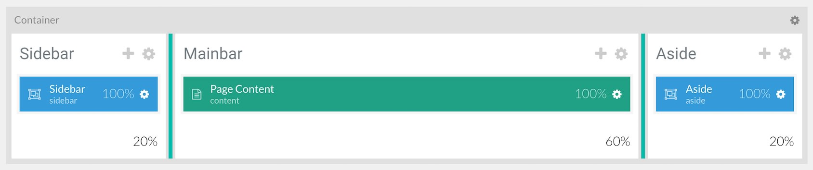
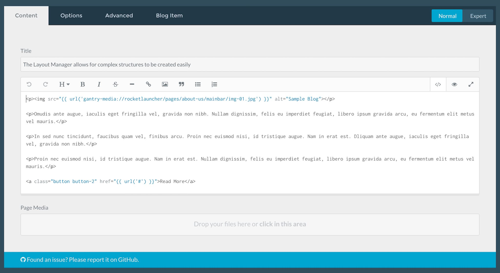

# Introduction

The **Blog** example page demonstrates how you can create a beautiful page with the Interstellar theme. Here is some information to help you replicate this page as it appears in the demo.

# Modules and Particles

The bulk if this page is made up of **Page Content** generated in the **Mainbar** section.

Even though there are module positions placed in the layout, as there are no other elements assigned to this page, only the content in the **Page Content** particle are displayed.

# Mainbar Section

The **Mainbar** section includes several articles assigned to the **Blog** category, displayed through the **Page Content** particle. Here are the settings found in the **The Layout Manager allows for complex structures to be created easily** page.

| Option     | Setting                                                                            |
| :--------- | :--------------------------------------------------------------------------------- |
| Title      | `The Layout Manager allows for complex structures to be created easily`            |
| Alias      | `the-layout-manager-allows-for-complex-structures-to-be-created-easily`            |

**Content Body**

~~~ .html

Omudis ante augue, iaculis eget fringilla vel, gravida non nibh. Nullam dignissim, felis eu imperdiet feugiat, libero ipsum gravida arcu, eu fermentum elit metus vel mauris.

In sed nunc tincidunt, faucibus quam vel, finibus arcu. Proin nec euismod nisi, id tristique augue. Nam in erat est. Dliquam ante augue, iaculis eget fringilla vel, gravida non nibh.

Proin nec euismod nisi, id tristique augue. Nam in erat est. Nullam dignissim, felis eu imperdiet feugiat, libero ipsum gravida arcu, eu fermentum elit metus vel mauris.

<a class="button button-2" href="{{ url('#') }}">Read More</a>
~~~
