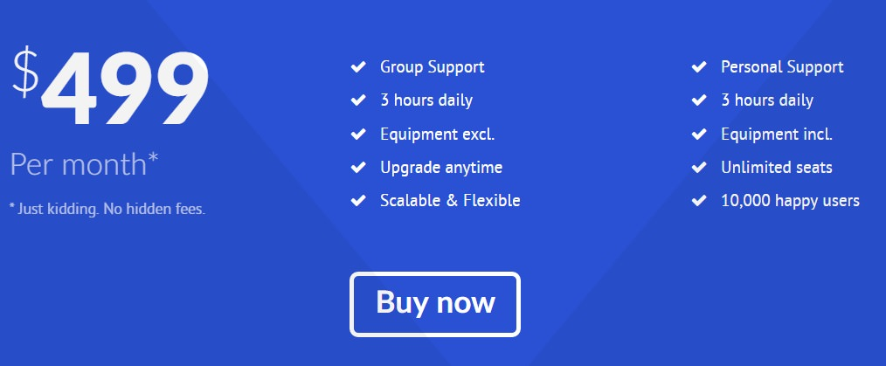

# Introduction

The **Bottom** section includes one **Pricing Table** particle.

Here is a breakdown of the widget(s) and particle(s) that appear in this section:

* [Pricing Table (particle)](#pricing-table-(particle))

# Section Settings

| Option           | Setting                   |
| :--------------- | :----------               |
| Layout           | Fullwidth (Boxed Content) |
| CSS Classes      | Blank                     |
| Tag Attributes   | Blank                     |

# Pricing Table (Particle)

## Particle Settings

| Option                | Setting                           |
| :-----                | :-----                            |
| Particle Name         | `Pricing Table`                   |
| CSS Classes           | Blank                             |
| Header Text           | Blank                             |
| Footer Text           | Blank                             |
| Grid Columns          | 3 Columns                         |
| Item 1 Name           | `Part 1`                          |
| Item 1 Accent Color   | White                             |
| Item 1 Custom Color   | Blank                             |
| Item 1 CSS Classes    | Blank                             |
| Item 1 Ribbon Text    | Blank                             |
| Item 1 Icon           | Blank                             |
| Item 1 Price          | `$499`                            |
| Item 1 Period         | `Per Month*`                      |
| Item 1 Description    | `* Just kidding. No hidden fees.` |
| Item 1 Button Label   | Blank                             |
| Item 1 Button Link    | Blank                             |
| Item 1 Target         | Self                              |
| Item 1 Button Classes | Blank                             |
| Item 1 Items          | Blank                             |

## Block Settings

| Option         | Setting   |
| :-----         | :-----    |
| CSS ID         | Blank     |
| CSS Classes    | Blank     |
| Variations     | Blank     |
| Tag Attributes | Blank     |
| Fixed Size     | Unchecked |
| Block Size     | `100%`    |

