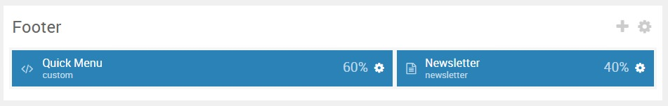

## Introduction

:   1. **Custom HTML (Particle)** [5%, 1%, se]
    2. **Newsletter (Particle)** [5%, 60%, se]

The **Footer** section includes two particles: **Custom HTML** and **Newsletter**.

Here is a breakdown of the module(s) and particle(s) that appear in this section:

* [Custom HTML (particle)](#custom-html-(particle))
* [Newsletter (particle)](#newsletter-(particle))

## Section Settings

| Option           | Setting                   |
| :--------------- | :----------               |
| Layout           | Fullwidth (Boxed Content) |
| CSS Classes      | Blank                     |
| Tag Attributes   | Blank                     |

## Custom HTML (Particle)

### Particle Settings

| Option             | Setting       |
| :-----             | :-----        |
| Particle Name      | `Custom HTML` |
| Process Twig       | Unchecked     |
| Process Shortcodes | Unchecked     |

**Custom HTML**

~~~ .html

<ul class="nomarginall noliststyle">
<li><a href="#">About</a></li>
<li><a href="#">Our Blog</a></li>
<li><a href="#">Our Team</li>
<li><a href="#">We're hiring!</a></li>
</ul>

<ul class="nomarginall noliststyle">
<li><a href="#">FAQ</a></li>
<li><a href="#">Support</a></li>
<li><a href="#">Showcase</li>
<li><a href="#">Contact Us</a></li>
</ul>

<ul class="nomarginall noliststyle">
<li><a href="#">Tumblr</a></li>
<li><a href="#">Facebook</a></li>
<li><a href="#">Twitter</li>
<li><a href="#">Pinterest</a></li>
</ul>

~~~

### Block Settings

| Option         | Setting   |
| :-----         | :-----    |
| CSS ID         | Blank     |
| CSS Classes    | Blank     |
| Variations     | Blank     |
| Tag Attributes | Blank     |
| Fixed Size     | Unchecked |
| Block Size     | `60%`     |

## Newsletter (Particle)

### Particle Settings

| Option         | Setting                                                                       |
| :-----         | :-----                                                                        |
| Particle Name  | `Newsletter`                                                                  |
| CSS Classes    | Blank                                                                         |
| Width          | Full Width                                                                    |
| Layout         | Stack Compact                                                                 |
| Style          | Square                                                                        |
| Title          | Blank                                                                         |
| Heading Text   | `Let's stay in touch. Subscribe to our newsletter to get the weekly updates.` |
| Side Text      | Blank                                                                         |
| InputBox Text  | `Your email address`                                                          |
| Button Icon    | `fa fa-chevron-circle-right`                                                  |
| Button Text    | Blank                                                                         |
| Feedburner URI | Blank                                                                         |
| Button Classes | Blank                                                                         |

### Block Settings

| Option         | Setting   |
| :-----         | :-----    |
| CSS ID         | Blank     |
| CSS Classes    | Blank     |
| Variations     | Blank     |
| Tag Attributes | Blank     |
| Fixed Size     | Unchecked |
| Block Size     | `40%`     |
