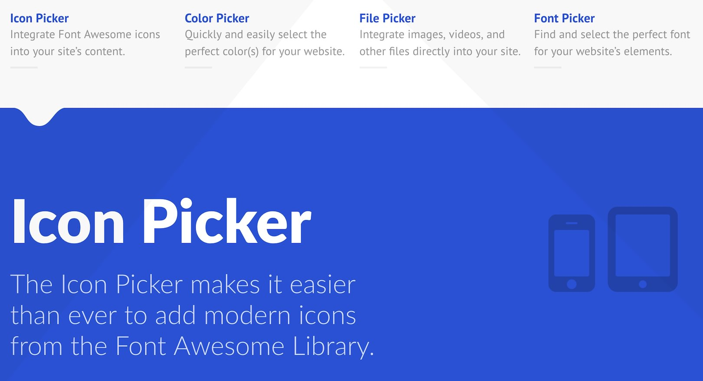
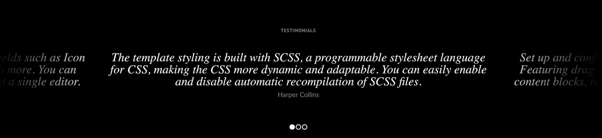
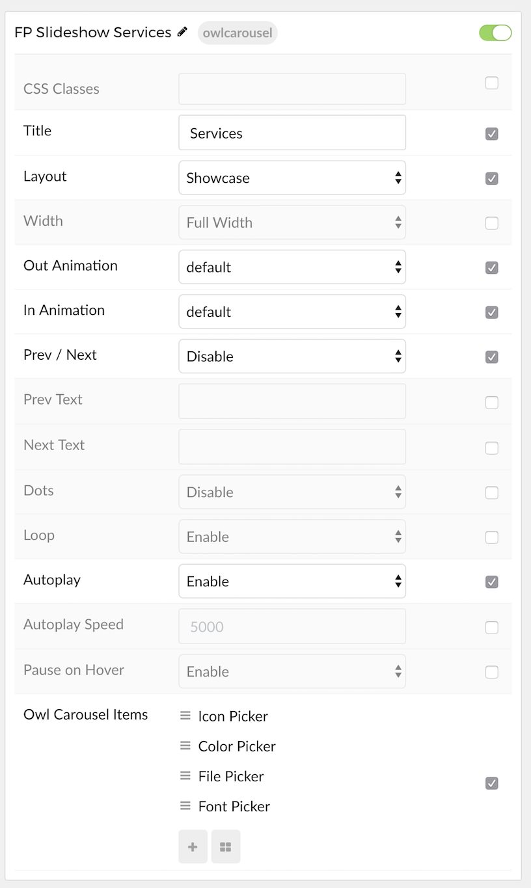
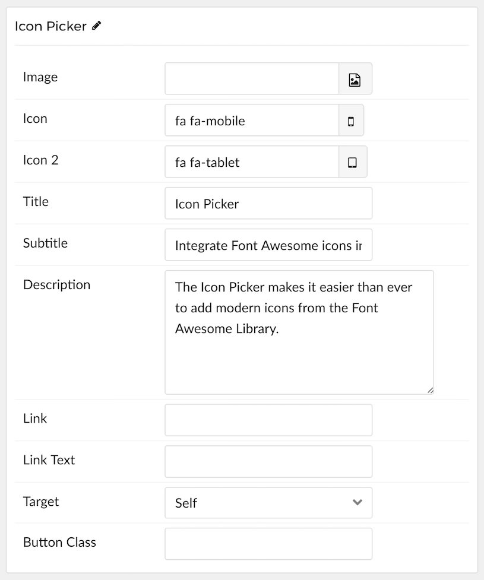

## Introduction

The **Owl Carousel** particle is a diverse particle with multiple layouts, a wide range of features and customization options, and the ability to source content from both the CMS and custom items set up in the particle itself.

The **Owl Carousel** particle is based on the open source project of the same name by [Bartosz Wojciechowski](http://www.owlcarousel.owlgraphic.com/index.html).

Here are the topics covered in this guide:

* [Layouts](#layouts)
    - [Standard](#standard)
    - [NewsSlider](#newsslider)
    - [Showcase](#showcase)
* [Configuration](#configuration)
    - [Main Options](#main-options)
    - [Item Options](#item-options)

## Layouts

Owl Carousel features four layouts, three of which are used in Interstellar's demo. You will see examples of these layouts below.

### Showcase

The **Showcase** layout enables you to set up a quick and elegant series of links to important content, along with thumbnails. Great for adding a simple list of featured headlines.

### Testimonial

The **Testimonial** layout enables you to display testimonies from customers, users, and other individuals in a simple and elegant fashion.

## Configuration

The settings panel for **Owl Carousel** is filled with options, bells, and whistles you can use to configure your particle. Here is a quick breakdown of the settings you will find in this particle in Interstellar.

### Main Options 

| Option          | Description                                                                                                                                  |
| :-----          | :-----                                                                                                                                       |
| CSS Classes     | Sets the CSS class for the content of the particle.                                                                                          |
| Title           | Sets the title of the particle, as it will appear on the front end.                                                                          |
| Layout          | Choose between the [supported layouts](#layouts) for the particle. This determines how the particle will look, and how content is displayed. |
| Width           | Choose between **Full Width** and **Compact** to determine how content is displayed.                                                         |
| Out Animation   | Sets the animation type as content is removed on the front end. `fadeOut` is a popular option.                                               |
| In Animation    | Sets the animation type as content is brought in. `fadeIn` is a popular option.                                                              |
| Prev Next       | Enables a previous / next switcher on the front end.                                                                                         |
| Prev Text       | Allows you to set text that appears in the Previous switch on the front end.                                                                 |
| Next Text       | Allows you to set text that appears in the Next switch on the front end.                                                                     |
| Dots            | Enables or disables pagination dots.                                                                                                         |
| Loop            | Enables or disables looping of content, going from finish to start continuously.                                                             |
| Autoplay        | Enables or disables autoplay, allowing the particle to automatically move through items.                                                     |
| Autoplay Speed  | Sets the speed at which items are automatically progressed in autoplay.                                                                      |
| Pause on Hover  | Pauses the automatic switching between items in autoplay.                                                                                    |

### Item Options

These items only appear on the front end if you select **Particle** as the **Content Source**.

| Option           | Description                                                                                                                                                      |
| :-----           | :-----                                                                                                                                                           |
| Name             | Sets the name for the item in the carousel. This is only seen on the back end.                                                                                   |
| Image            | Enables you to define an image for the item. This is the primary image that appears most prominently as the item is displayed.                                   |
| Icon             | You can use this field to assign an icon to the item that appears with its **Title**. For example: `fa fa-cogwheel fa-fw`.                                       |
| Icon 2           | You can use this field to assign a second icon.                                                                                                                  |
| Title            | Enter a title for the item here.                                                                                                                                 |
| Subtitle         | Enter the item's subtitle here. Typically displayed just below the title in a smaller font.                                                                      |
| Description      | This is the main content body of the item. Enter any information you want to have displayed in paragraph form here.                                              |
| Link             | This is where you would enter a link you want the item to send visitors to when clicked.                                                                         |
| Link Text        | This text is what the visitor would click to activate the link.                                                                                                  |
| Target           | Sets how you would like the link to open. You can choose between **Self** and **New Window**. Self will open in the current tab, and new window opens a new tab. |
| Button Classes   | This field enables you to enter a CSS class you would like to apply to the clickable link's button.                                                              |
