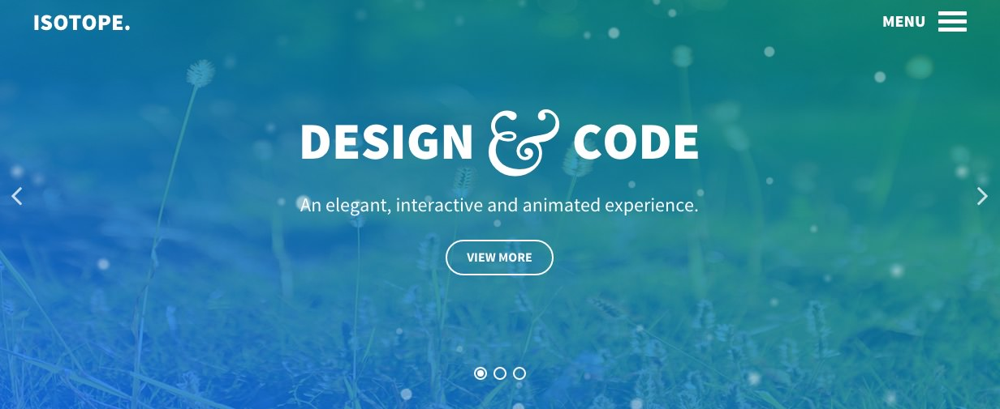

Introduction
-----

Isotope is a theme bolstered with bold and impressive visual elements, to add depth to your site, whilst remaining within an elegant and acute design paradigm. Reimagine your site with this vibrant, adaptable and highly customizable theme.

Requirements
-----
* PHP 7.2+
* Curl
* OpenSSL Libraries
* Multibyte String Support

>> NOTE: Gantry v5.4.9+ is required for Acronym to work correctly. For more details on the Gantry Framework, please visit its [Dedicated Website](http://gantry.org).

Key Features
-----

### Included Particles

* Block Content
* Branding
* Contact
* Content List
* FlexSlider
* Flipping Content
* Grav Content
* Grid Content
* Horizontal Menu
* Image Grid
* Info List
* Mobile Menu
* Newsletter
* Overlay Toggle
* Popup Grid
* Promo Content
* Promo Image
* Simple Counter 

### Theme Features

* Responsive Layout
* 6 Preset Styles
* Block Variations
* Custom Typography
* Unlimited Positions
* Custom Particles
* Horizontal Menu
* Social Icons
* Mobile Menu
* Coming Soon Page
* Font Awesome Icons 

### Gantry Core Features

* YAML-based Configuration
* Twig Templating
* Powerful Particle System
* Visual Menu Editor
* MegaMenu Support
* Off-Canvas Panel
* Ajax Admin
* Layout Manager
* Inheritance System
* Fluid Width Option
* Fixed Width Option
* SCSS Support
* Sophisticated Fields
* Unlimited Undo/Redo
* Styles Panel

## Particles

The theme features a range of custom particles, including Popup Grid, a mosaic styled content element. It supports a custom modal effect which is a full screen overlay for an enlarged image and full length content items, with easy configuration.

## Menu Overlay

Isotope features two custom menu options. The Menu Overlay is displayed in a fixed, full width overlay, with support for additional blocks. An inline, horizontal option is also available, with Headroom support for dynamic scrolling.

## Responsive

Isotope is a responsive theme which means it adapts to the viewing device's width, such as mobile, tablet or desktop. Mobile modes have a unique menu to aid usability. Support classes can also be used to display or hide various types of content for each device.
