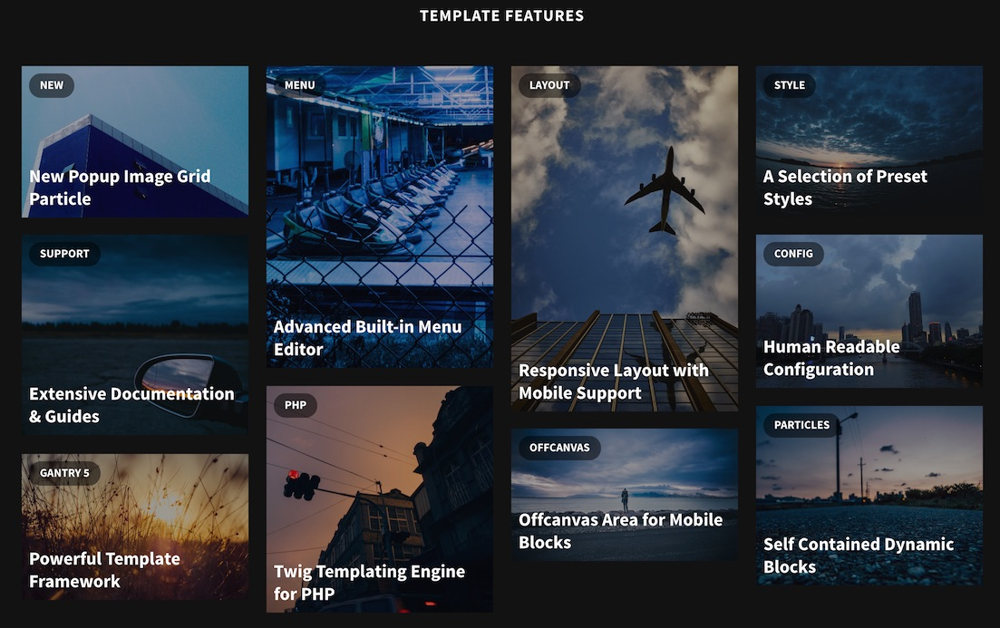
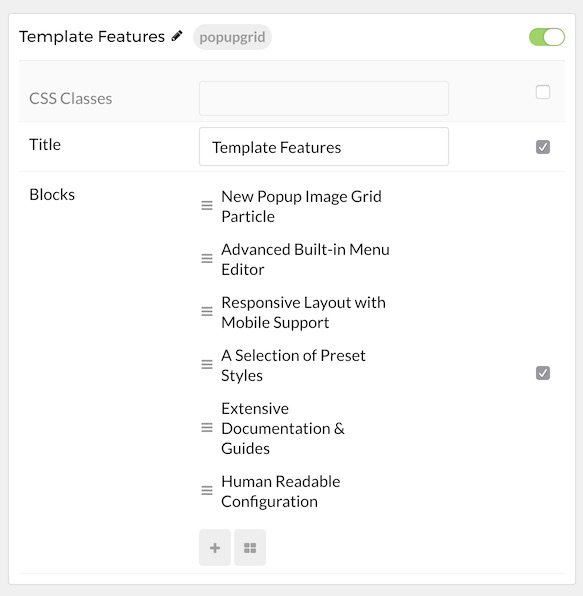
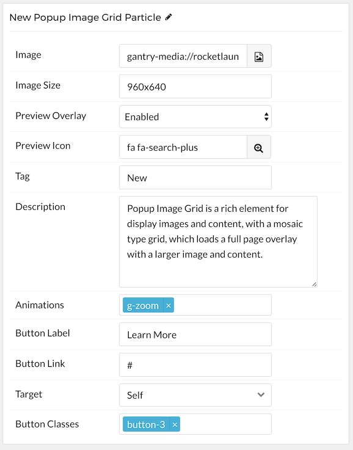

## Introduction

The **Popup Grid** particle is a beautiful image particle that enables you to create a mosaic of images that, when selected, pop up and present the visitor with additional information.

Here are the topics covered in this guide:

* [Configuration](#configuration)
    - [Main Options](#main-options)
    - [Item Options](#item-options)

## Configuration

### Main Options 

These options affect the main area of the particle, and not the individual items within.

| Option        | Description                                                                                 |
| :-----        | :-----                                                                                      |
| Particle Name | Enter the name you would like to assign to the particle. This only appears in the back end. |
| CSS Classes   | Enter the CSS class(es) you want to use in the content of the particle.                     |
| Title         | Enter a title for the particle.                                                             |

### Item Options

These items make up the individual featured items in the particle.

| Option          | Description                                                                                                                           |
| :-----          | :-----                                                                                                                                |
| Item Name       | Enter the name you would like to assign to the item. This only appears in the back end.                                               |
| Image           | Select an image to display in the item.                                                                                               |
| Image Width     | Input the image width (in pixels)                                                                                                     |
| Image Size      | Input the image size (in pixels) in a `WidthXHeight` format. For example: `460x920`                                                   |
| Preview Overlay | Enable or disable the overlay when hovering your cursor over the item.                                                                |
| Preview Icon    | Select an icon that appears along with the preview overlay. For example: `fa fa-search-plus fa-fw fa-2x`                              |
| Tag             | Tag the item.                                                                                                                         |
| Description     | Add a text description that appears when you select the item.                                                                         |
| Animations      | Enter any animations you wish to have apply when you select the item. Options are: `g-zoom`, `g-blur`, `g-rotate`, and `g-grayscale`. |
| Button Label    | Enter any text you wish to have appear in the button.                                                                                 |
| Button Link     | Enter the URL you wish to have the button link to.                                                                                    |
| Target          | Choose between **Self** and **New Window** as the link's target.                                                                      |
| Button Classes  | Add any CSS Class(es) you want to have apply to the button.                                                                           |
