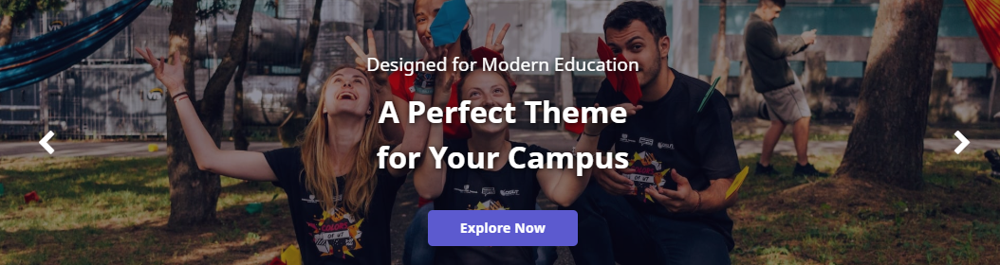
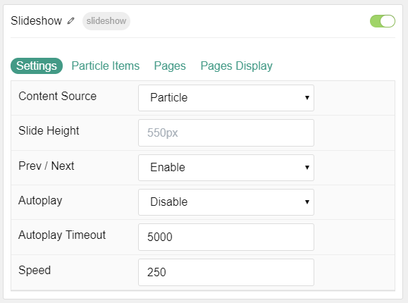
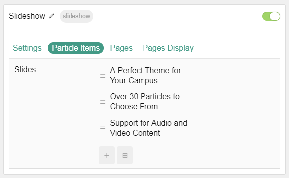
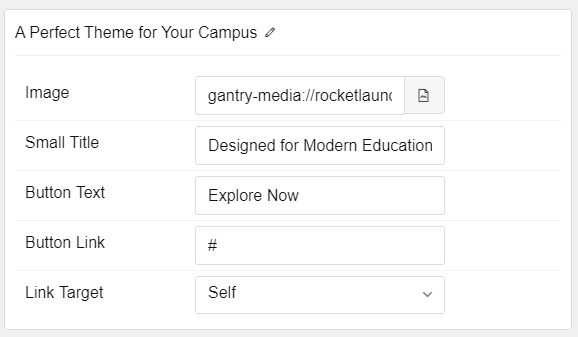
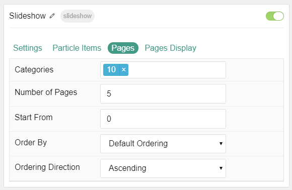
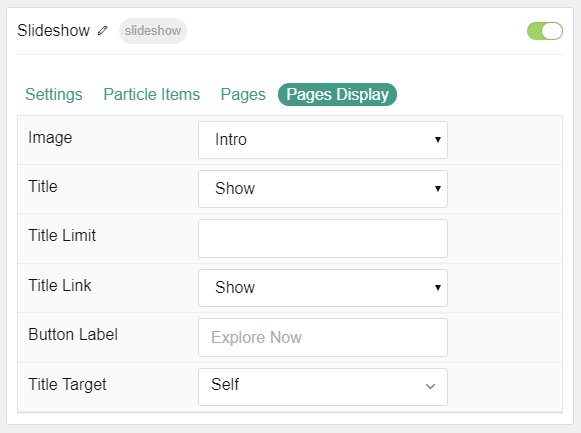

## Introduction

The **Slideshow** particle creates beautiful image slideshows that work perfectly at the top of your page.

Here are the topics covered in this guide:

* [Configuration](#configuration)
    - [Main Options](#settings)
    - [Item Options](#particle-item-options)
    - [Posts](#articles)
    - [Display](#display)

## Configuration

### Settings 

These options affect the main area of the particle, and not the individual items within. You can set the title of the particle, as well as give it an introductory paragraph here.

| Option           | Description                                                                                            |
| :-----           | :-----                                                                                                 |
| Particle Name    | This is the name of the particle used for back end management. It does not appear on the front end.    |
| Content Source   | Choose between **Particle** and **Grav** as the content source for the particle.                     |
| Slide Height     | Set the height of each slide (in pixels)                                                               |
| Prev / Next      | Add prev/next navigation to the slideshow.                                                             |
| Autoplay         | **Enable** or **Disable** autoplay for hte particle.                                                   |
| Autoplay Timeout | Set the time (in milliseconds) between slides in autoplay mode.                                        |
| Speed            | Set the transition speed (in milliseconds).                                                            |

### Particle Item Options

These items make up the individual featured items in the particle. Items in this section will only appear if **Particle** is selected as the **Content Source**.

| Option       | Description                                                                            |
| :-----       | :-----                                                                                 |
| Item Name    | This is the name of the item. This becomes the headline for the item on the front end. |
| Image        | Set an image for the item. This is the main image.                                     |
| Small Title  | Enter a small title to appear on the front end.                                        |
| Button Title | Enter a title to appear in the button.                                                 |
| Slide Link   | Enter a link for the image to send users to.                                           |
| Link Target  | Enter a target window for the link.                                                    |

### Posts

| Option             | Description                                                                                  |
| :-----             | :-----                                                                                       |
| Categories         | Select the categories of articles this particle will display.                                |
| Number of Pages    | Enter the maximum number of pages to display.                                                |
| Start From         | Enter offset specifying the first article to return. The default is '0' (the first article). |
| Order By           | Choose the type of factor to order by.                                                       |
| Ordering Direction | Choose between **Ascending** and **Descending** as the article ordering method.              |

### Display

This section configures how articles are displayed.

| Option       | Description                                              |
| :-----       | :-----                                                   |
| Image        | Choose to **Show** or **Hide** the article's image.      |
| Title        | Choose to **Show** or **Hide** the title.                |
| Title Limit  | Enter a limit (characters) for the title.                |
| Title Link   | Choose to **Show** or **Hide** the title link.           |
| Button Label | Enter a text string to display as the button link.       |
| Title Target | Choose the target window for the button link to open in. |