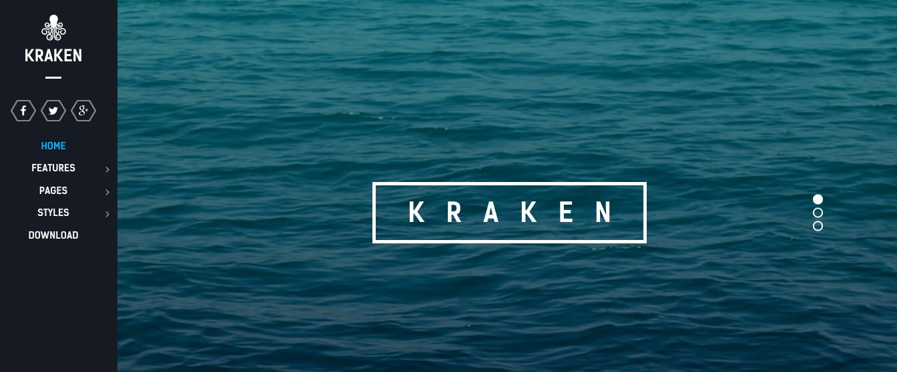

Introduction
-----

Kraken is a theme bolstered with bold and impressive visual elements, to add depth to your site, whilst remaining within an elegant and acute design paradigm. Reimagine your site with this vibrant, adaptable and highly customizable theme.

New to Gantry 5?
-----
If you are new to Gantry 5, a good place to start would be our [dedicated Gantry documentation](http://docs.gantry.org).

Requirements
-----
* PHP 7.1+
* Curl
* OpenSSL Libraries
* Multibyte String Support

>> NOTE: Gantry v5.4.9+ is required for Acronym to work correctly. For more details on the Gantry Framework, please visit its [Dedicated Website](http://gantry.org).

Key Features
-----

### Included Particles

* Block Content
* Branding
* Content List
* Copyright
* Custom HTML
* Grav Content
* Grid Content
* Grid Statistic
* Horizontal Menu
* Icon Menu
* Image Grid
* Info List
* Mobile Menu
* Newsletter
* Promo Image
* Side Menu
* Simple Counter
* Swiper 

### Theme Features

* Responsive Layout
* 6 Light Preset Styles
* 2 Dark Preset Styles
* Block Variations
* Custom Typography
* Unlimited Positions
* Custom Particles
* Fixed Side Position
* Animated Side Menu
* Horizontal Menu
* Social Icons
* Mobile Menu
* Coming Soon Page
* Font Awesome Icons 

### Gantry Core Features

* YAML-based Configuration
* Twig Templating
* Powerful Particle System
* Visual Menu Editor
* MegaMenu Support
* Off-Canvas Panel
* Ajax Admin
* Layout Manager
* Inheritance System
* Fluid Width Option
* Fixed Width Option
* SCSS Support
* Sophisticated Fields
* Unlimited Undo/Redo
* Styles Panel

## FixedSide

The FixedSide position is similar to offcanvas, by allowing you to position blocks outside of the main wrapper of the theme. For Kraken, FixedSide contains the logo and social icons, but can be adjusted to use whatever blocks you prefer.

## Particles

Kraken includes a selection of custom Particles available for demonstration in our Typography page. Particles operate as customizable blocks that form the flesh of the frontend, from placeholders to self contained content and functions.

## Responsive

Kraken is a responsive theme which means it adapts to the viewing device's width, such as mobile, tablet or desktop. Mobile modes have a unique menu to aid usability. Support classes can also be used to display or hide various types of content for each device.
