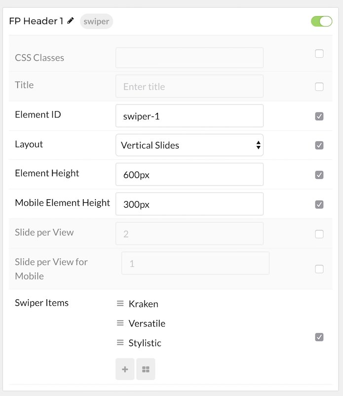

## Introduction

The **Swiper** particle makes it easy to create smooth, modern sliders for your website.

Here are the topics covered in this guide:

* [Configuration](#configuration)
    - [Main Options](#main-options)
    - [Item Options](#item-options)

## Configuration

### Main Options 

These options affect the main area of the particle, and not the individual items within.

| Option                    | Setting                                                                                                                             |
| :-----                    | :-----                                                                                                                              |
| Particle Name             | The name of the particle for organizational use in the backend.                                                                     |
| CSS Classes               | CSS Class(es) you would like to have apply to the particle's content. In the front page of our demo we used: `fp-swiper-slideshow`. |
| Title                     | Title of the particle as it will appear on the front end.                                                                           |
| Element ID                | Please put unique text Element ID to differ it with another of the same particle, for example: `swiper-1`, `swiper-2`, etc.         |
| Layout                    | Select a layout style to apply to the particle. Choose `Horizontal Slides`, `Vertical Slides`, or `Carousel`.                       |
| Element Height            | Set the Element Height (in pixels) if you choose Horizontal or Vertical Slides layout.                                              |
| Mobile Element Height     | Set the Element Height (in pixels) for mobile devices if you choose **Horizontal** or **Vertical** Slides layout.                   |
| Slide per View            | Set the amount for the Slide per View for **Carousel** layout.                                                                      |
| Slide per View for Mobile | Set the amount for the Slide per View for **Carousel** layout for mobile devices.                                                   | 

### Item Options

These items make up the individual featured items in the particle.

| Option      | Description                                                    |
| :-----      | :-----                                                         |
| Name        | Enter a name for your item. This only appears on the back end. |
| Image       | Set an image for the item.                                     |
| Title       | Enter a title for the item.                                    |
| Subtitle    | Enter a subtitle for the item.                                 |
| Description | Enter a description for the item.                              |
