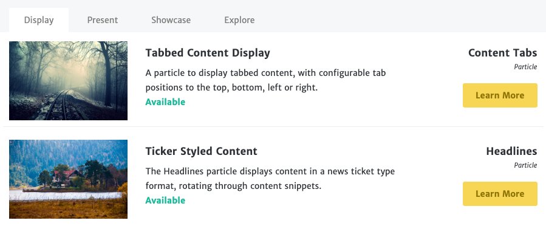
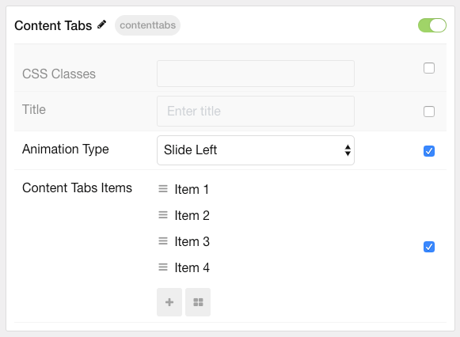
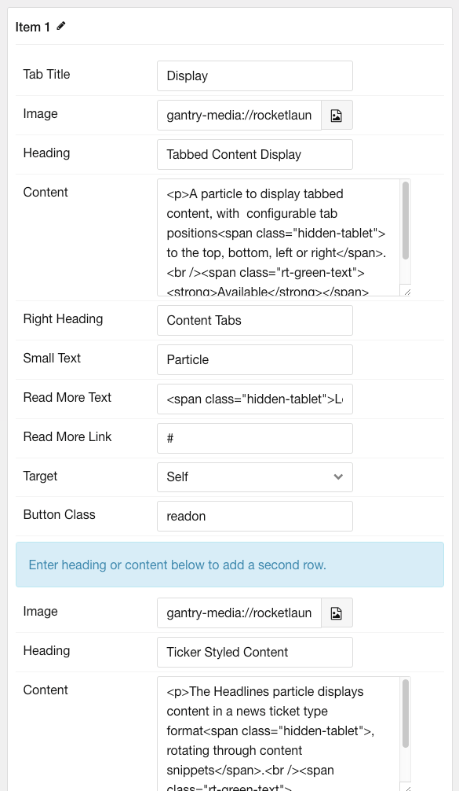
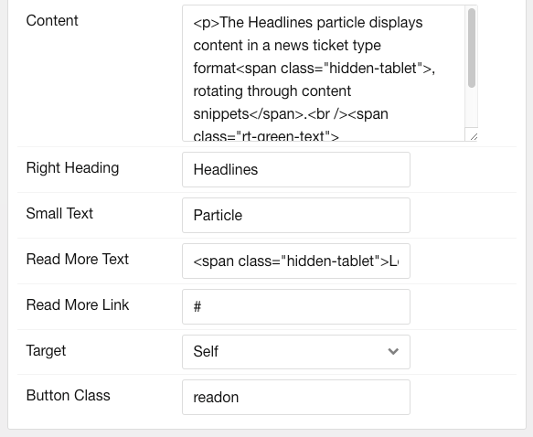

## Introduction

The **Content Tabs** particle lets you display an abundance of different categories of content in a small space using tabs.

Here are the topics covered in this guide:

* [Configuration](#configuration)
  * [Main Options](#main-options)
  * [Item Options](#item-options)

## Configuration

### Main Options

These options affect the main area of the particle, and not the individual items within. You can set the title of the particle, as well as give it an introductory paragraph here.

| Option         | Description                                                                     |
| :-----         | :-----                                                                          |
| CSS Classes    | Set the CSS class(es) you would like to have apply at the particle level.       |
| Title          | Enter the title of the particle you would like to have appear on the front end. |
| Animation Type | Select the type of transition animation to use when switching between tabs.     |

### Item Options

These items make up the individual featured items in the particle.

| Option         | Description                                                                                      |
| :------------- | :----------------------------------------------------------------------------------------------- |
| Name           | The name if the item is used for backend organization only and does not appear on the front end. |
| Tab Title      | Enter a title for the item that appears in the title.                                            |
| Image          | Enter an image to appear in the first item.                                                      |
| Heading        | Enter a heading (headline) for the first item.                                                   |
| Content        | Enter text/HTML content for the first item.                                                      |
| Right Heading  | Create a secondary headline to appear on the right side. This is typically a category.           |
| Small Text     | Eter small text to appear under the right heading.                                               |
| Read more Text | Enter any text that you wish to have displayed in the item.                                      |
| Read more Link | Enter the URL you would like to have the item link to.                                           |
| Target         | Choose the target window for the read more buttons to open in.                                   |
| Button Class   | Enter any CSS class(es) you want to have apply to the buttons in the first part of the tab.      |
| Image          | Enter an image to appear in the second item.                                                     |
| Heading        | Enter a heading (headline) for the second item.                                                  |
| Content        | Enter text/HTML content for the second item.                                                     |
| Right Heading  | Create a secondary headline to appear on the right side. This is typically a category.           |
| Small Text     | Eter small text to appear under the right heading.                                               |
| Read more Text | Enter any text that you wish to have displayed in the item.                                      |
| Read more Link | Enter the URL you would like to have the item link to.                                           |
| Target         | Choose the target window for the read more buttons to open in.                                   |
| Button Class   | Enter any CSS class(es) you want to have apply to the buttons in the second part of the tab.     |