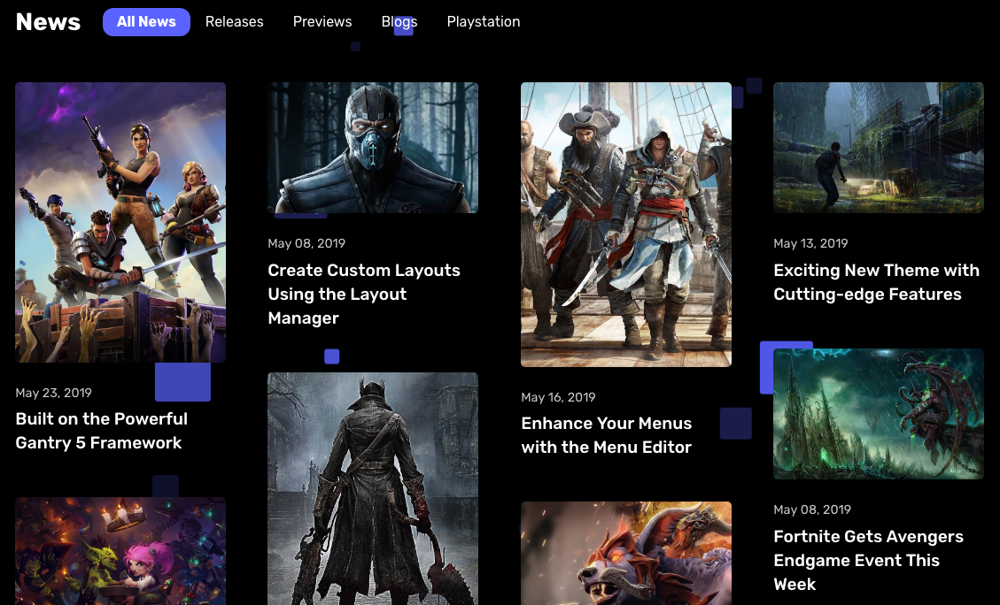
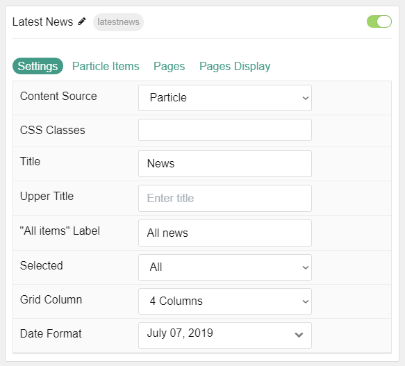
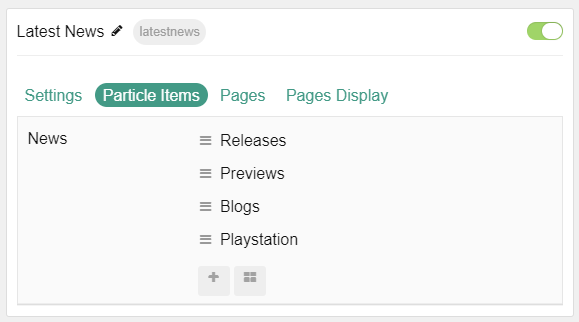
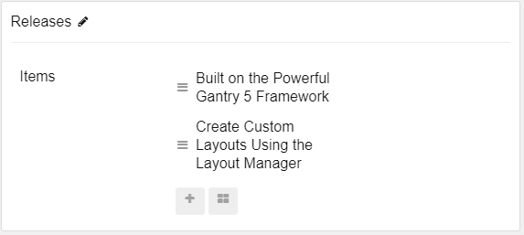
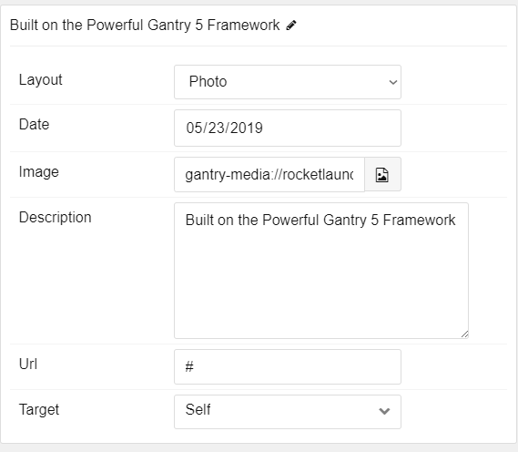
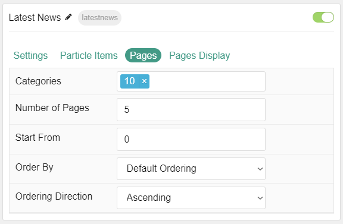
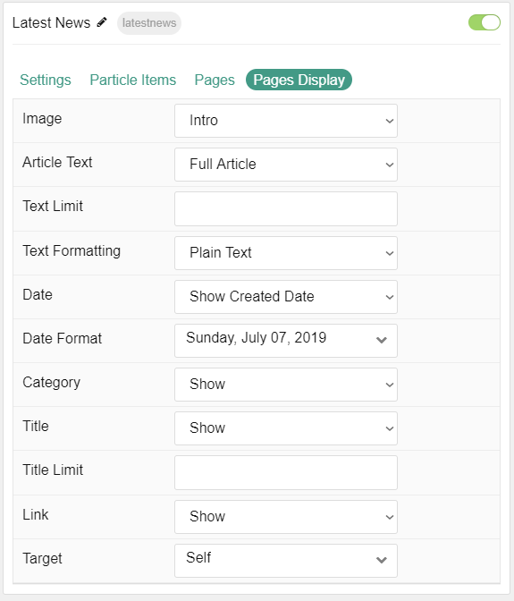

## Introduction

The **Latest News** particle displays your latest posts or featured content, along with images and text.

Here are the topics covered in this guide:

* [Configuration](#configuration)
    - [Main Options](#settings)
    - [Item Options](#particle-item-options)
    - [Pages](#pages)
    - [Display](#display)

## Configuration

### Settings

These options affect the main area of the particle, and not the individual items within. You can set the title of the particle, as well as give it an introductory paragraph here.

| Option          | Description                                                                                         |
|:--------------- |:--------------------------------------------------------------------------------------------------- |
| Particle Name   | This is the name of the particle used for back end management. It does not appear on the front end. |
| Content Source  | Choose between **Particle** and **Grav** as the Content Source.                                   |
| CSS Classes     | Enter any CSS class(es) you wish to have apply to the particle.                                     |
| Title           | Set a title for the particle.                                                                       |
| Upper Title     | Enter a title to appear above the main title.                                                       |
| All Items Label | Enter a text label to bring up all items regardless of category.                                    |
| Selected        | Choose the selected nav item by default.                                                            |
| Grid Column     | Set the number of columns items appear in.                                                          |
| Date Format     | Select the date format to be displayed.                                                             |

### Particle Item Options

These items make up the individual featured items in the particle. Items in this section will only appear if **Particle** is selected as the **Content Source**.

| Option      | Description                                                                              |
|:----------- |:---------------------------------------------------------------------------------------- |
| Item Name   | This is the name of the item. This appears as the item's title on the front end.         |
| Layout      | Choose between **Photo**, **Photo Large**, and **Text** as the layout type for the item. |
| Date        | Enter a date for the post.                                                            |
| Image       | Set an image to appear in the item.                                                      |
| Description | Enter a text description for the item.                                                   |
| URL         | Enter a URL you would like the item to link to.                                          |
| Target      | Select a target window for the URL to open through.                                      |

### Pages

| Option             | Description                                                                                                |
|:------------------ |:---------------------------------------------------------------------------------------------------------- |
| Categories         | Select the categories of posts this particle will display.                                                 |
| Posts              | Select the number of posts you would like the particle to fetch.                                           |
| Sticky Posts       | Choose how Sticky Posts should be filtered. Choose between **Include**, **Exclude**, or **Only Featured**. |
| Number of Posts    | Enter the maximum number of posts to display.                                                              |
| Start From         | Enter offset specifying the first post to return. The default is '0' (the first post).               |
| Order By           | Choose the type of factor to order by.                                                                     |
| Ordering Direction | Choose between **Ascending** and **Descending** as the post ordering method.                            |

### Display

This section configures how posts are displayed.

| Option          | Description                                                                                        |
|:--------------- |:-------------------------------------------------------------------------------------------------- |
| Image           | Display the image assigned to the post's **Intro**, **Full** or **None**.                          |
| Article Text    | Choose between **Introduction**, **Hide**, and **Full Article** for the post text to be displayed. |
| Text Limit      | Set a limit (in characters) for the post text displayed.                                           |
| Text Formatting | Choose between **HTML** and **Plain Text** formatting for the post's text.                         |
| Date            | **Show** or **Hide** post dates.                                                                   |
| Date Format     | Set the format that dates will be displayed in.                                                    |
| Category        | **Show** or **Hide** the category.                                                                 |
| Read More       | **Show** or **Hide** the Read More link.                                                           |
| Read More Label | Enter a text label to appear as the read more link                                                 |
| Title           | **Show** or **Hide** the post's title.                                                             |
| Title Limit     | Enter the maximum number of characters in the title to display.                                    |
| Link            | Show or Hide the link.                                                                             |
| Target          | Choose the target window for the link to open into.                                                |

>> Note: When using Grav Content source, images can utilize the **Photo Large** layout by adding **photo-large** to the **Alt Text** field for either the Intro or Full image of the Article(s) you are displaying.
