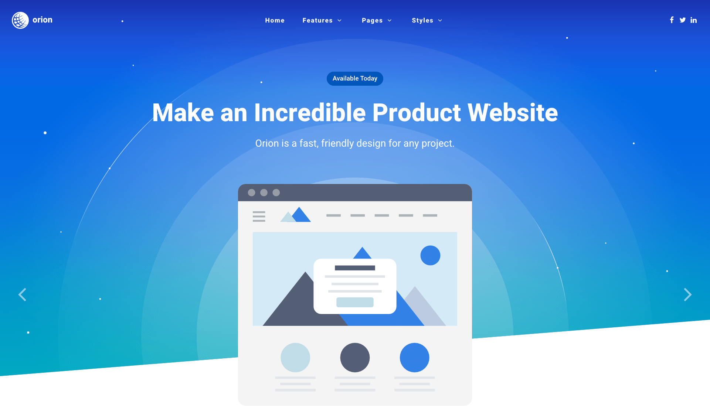

Introduction
-----

Orion is an intuitive product showcase theme featuring robust colors, stellar background elements, and an abundant selection of exclusive particles. A fast, friendly design for any project, application, or portfolio. Download it today!

New to Gantry 5?
-----
If you are new to Gantry 5, a good place to start would be our [dedicated Gantry documentation](http://docs.gantry.org).

As a Grav user, you are most likely accustomed to editing modules when working with our Gantry 4 themes. While our RocketLauncher package contains modules for our subpages, the Home page content is specifically found in the theme's Layout. This can be found via your **Grav administrator -> Extensions -> Themes - > Home -> Layout**. Click on any of the cog icons on the Particles to edit the content.

To understand more how the Layout manager works, please [click here](http://docs.gantry.org/gantry5/configure/layout-manager).

Requirements
-----

* PHP 7.2+
* Curl
* OpenSSL Libraries
* Multibyte String Support

>> NOTE: Gantry v5.4.32+ is required for Orion to work correctly. For more details on the Gantry Framework, please visit its [Dedicated Website](http://gantry.org).

Key Features
-----

### Included Particles

* Block Content
* Branding
* Button
* Comparison Table
* Copyright
* Custom HTML
* Date
* Grid Statistic
* Heading
* Icon Promo
* Image
* Image Grid
* Info List
* Grav Pages
* Latest News
* Logo / Image
* Logos
* Menu
* Mobile Menu
* Newsletter
* Popup Module
* Pricing Table
* Promo
* Quote
* Search
* Showcase
* Simple Content
* Simple Counter
* Simple Menu
* Slider
* Social
* Swiper
* Testimonials
* To Top
* User Stories
* Video

### Theme Features

* Responsive Layout
* 6 Preset Styles
* Block Variations
* Custom Typography
* Unlimited Positions
* Popup Module
* Custom Particles
* Social Icons
* Mobile Menu
* Coming Soon Page
* Font Awesome Icons

### Gantry Core Features

* YAML-based Configuration
* Twig Templating
* Powerful Particle System
* Visual Menu Editor
* MegaMenu Support
* Off-Canvas Panel
* Ajax Admin
* Layout Manager
* Inheritance System
* Fluid Width Option
* Fixed Width Option
* SCSS Support
* Sophisticated Fields
* Unlimited Undo/Redo
* Styles Panel

## Typography

Typography is an important instrument in not only the site design, but how your content is portrayed and utilized by your visitors. Therefore, Orion offers a rich selection of elegant typography to provide focus to varying content types.

## Responsive

Orion is a responsive theme which means it adapts to the viewing device's width, such as mobile, tablet or desktop. Mobile modes have a unique menu to aid usability. Support classes can also be used to display or hide various types of content for each device.

## Inheritance

Orion takes full advantage of Gantry’s new inheritance system, making it easier than ever to configure and manage your website through synced particles, atoms, sections, and layouts. Save time by using inheritance to avoid repetitive changes!