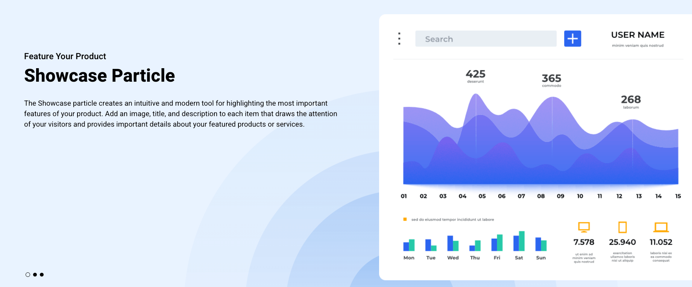
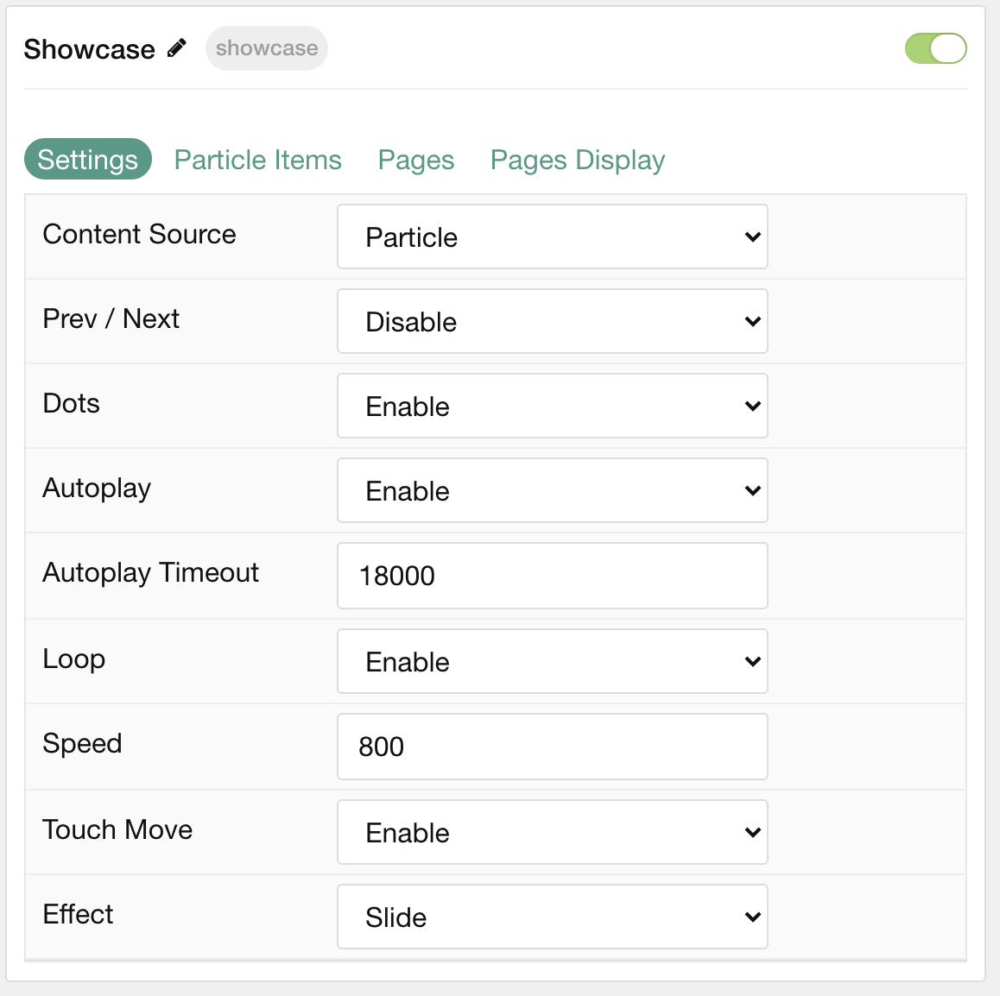
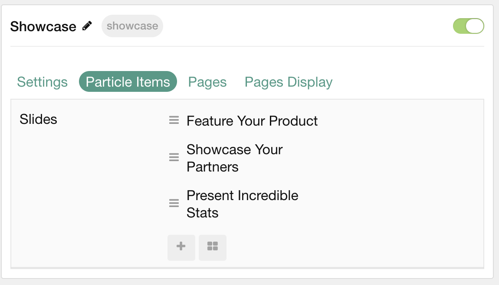
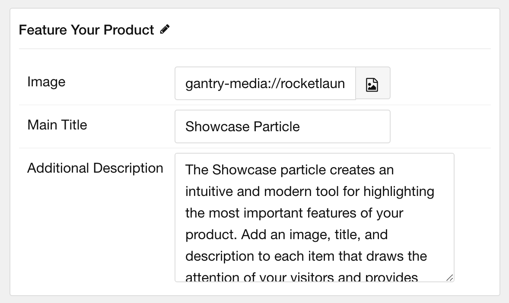
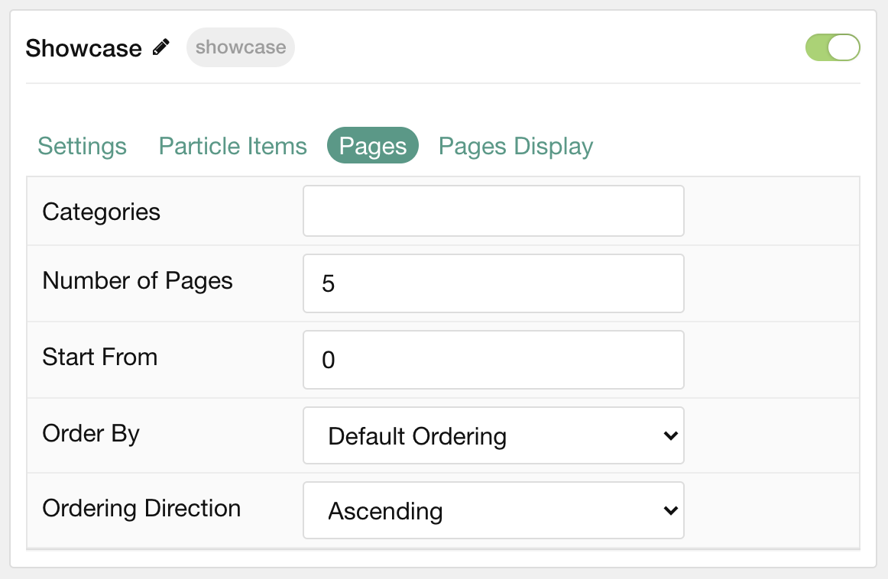
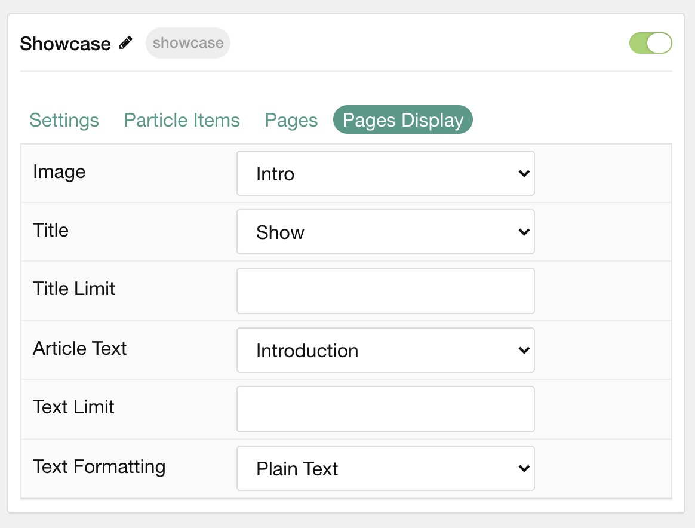

## Introduction

The **Showcase** particle creates blocks that combine text and images to highlight your product in a modern way.

Here are the topics covered in this guide:

- [Introduction](#introduction)
- [Configuration](#configuration)
  - [Settings](#settings)
  - [Particle Item Options](#particle-item-options)
  - [Pages](#pages)
  - [Display](#display)

## Configuration

### Settings

These options affect the main area of the particle, and not the individual items within. You can set the title of the particle, as well as give it an introductory paragraph here.

| Option                | Description                                                                                                     |
| :------               | :------                                                                                                         |
| Particle Name         | This is the name of the particle used for back end management. It does not appear on the front end.             |
| Content Source        | Choose between **Particle** and **Grav** as the content source for the particle.                              |
| Prev / Next           | **Enable** or **Disable** the Prev / Next navigation. Arrows will not appear unless they are actually required. |
| Dots                  | **Enable** or **Disable** dot navigation.                                                                       |
| Autoplay              | **Enable** or **Disable** autoplay for the particle.                                                            |
| Autoplay Timeout      | Set the time (in milliseconds) between slides in autoplay mode.                                                 |
| Loop                  | **Enable** or **Disable** looping slides.                                                                       |
| Speed                 | Set the transition speed (in milliseconds).                                                                     |
| Touch Move            | **Enable** or **Disable** touch movements.                                                                      |
| Effect                | Choose a slideshow effect. Options include: **Slide** or **Fade**.                                              |

### Particle Item Options

These items make up the individual featured items in the particle. Items in this section will only appear if **Particle** is selected as the **Content Source**.

| Option                 | Description                                                                                 |
| :-----------------     | :------------------------------------------------------------------------------------------ |
| Item Name              | This is the name of the item. It appears the the top of the text area on the front end.     |
| Image                  | Select an image to appear in the particle.                                                  |
| Main Title             | Enter a larger main title to appear on the front end.                                       |
| Additional Description | Enter a text paragraph that describes the item.                                             |

### Pages

| Option             | Description                                                                            |
| :-----             | :-----                                                                                 |
| Categories         | Select the categories of pages this particle will display.                             |
| Number of Pages    | Enter the maximum number of pages to display.                                          |
| Start From         | Enter offset specifying the first page to return. The default is '0' (the first page). |
| Order By           | Choose the type of factor to order by.                                                 |
| Ordering Direction | Choose between **Ascending** and **Descending** as the page ordering method.           |

### Display

This section configures how posts are displayed.

| Option             | Description                                                                                        |
| :-----------       | :------------------------------------------------------------------------------------------------- |
| Image              | Choose between the **Intro**, **Full**, or no image to display with each item.                     |
| Category           | **Show** or **Hide** a post's category.                                                            |
| Title              | **Show** or **Hide** the post's title.                                                             |
| Title Limit        | Enter the maximum number of characters in the title to display.                                    |
| Content Type       | Select the post text to appear in each item.                                                       |
| Content Limit      | Set a limit (in characters) of post text to appear in the item.                                    |
| Content Formatting | Display post content as **Plain Text** or **HTML**.                                                |
