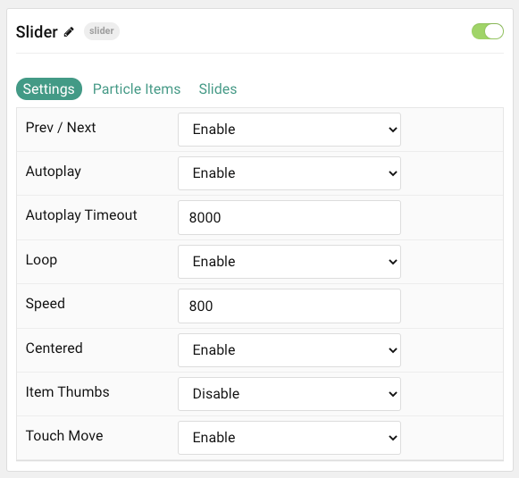
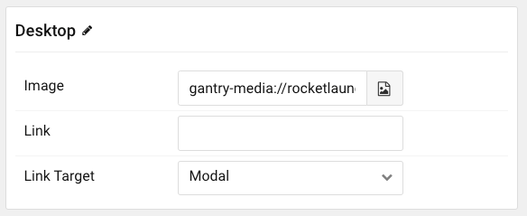

## Introduction

The **Slider** particle is a great way to display images in your website.

Here are the topics covered in this guide:

* [Configuration](#configuration)
    - [Main Options](#settings)
    - [Item Options](#particle-item-options)
    - [Slides](#slides)

## Configuration

### Settings 

These options affect the main area of the particle, and not the individual items within.

| Option           | Description                                                                                         |
| :-----           | :-----                                                                                              |
| Particle Name    | This is the name of the particle used for back end management. It does not appear on the front end. |
| Prev / Next      | **Enable** or **Disable** the prev / next navigation.                                               |
| Autoplay         | **Enable** or **Disable** autoplay.                                                                 |
| Autoplay Timeout | Set the time between each transition during autoplay.                                               |
| Loop             | **Enable** or **Disable** looping.                                                                  |
| Speed            | Set the transition speed between slides.                                                            |
| Centered         | **Enable** or **Disable** centered slides.                                                          |
| Item Thumbs      | **Enable** or **Disable** item name thumbnails.                                                     |
| Touch Move       | **Enable** or **Disable** touch-based control of slide movements.                                   |

### Particle Item Options

These items make up the individual featured items in the particle. Items in this section will only appear if **Particle** is selected as the **Content Source**.

| Option                 | Description                                                      |
| :-----                 | :-----                                                           |
| Item Name              | This is the name of the item. This only appears in the back end. |
| Image                  | Select an image to appear in the slide.                          |
| Link                   | Enter a URL you would like the item to link to.                  |
| Link Target            | Choose the target tab you would like the URL to open to.         |

### Slides

The **Slides** tab gives you control over how many slides appear for different experiences. It also includes control over the spacing between slides.

| Option           | Description                                    |
| :-----           | :-----                                         |
| Slides Per View  | Select a number of slides to appear per view.  |
| Slides Per Group | Select a number of slides to appear per group. |
| Space Between    | Enter a space (in px) to exist between slides. |
