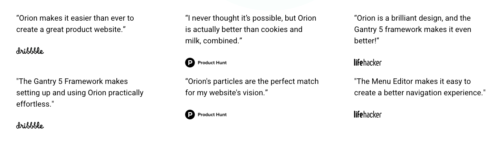
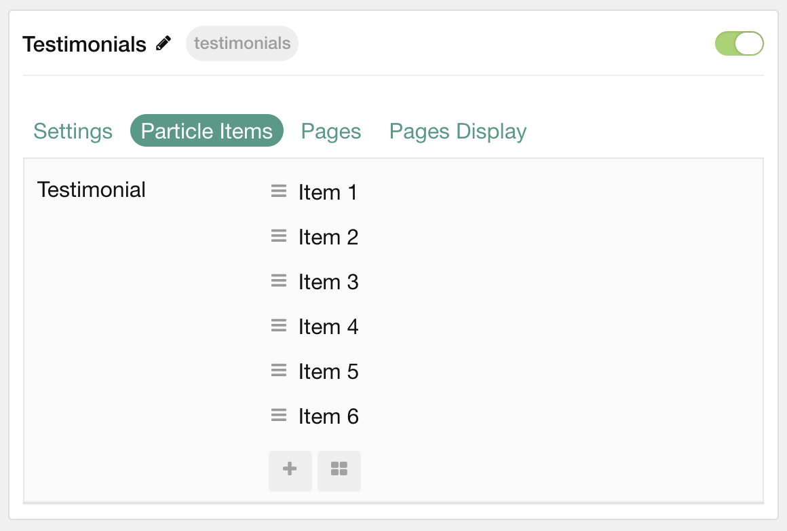
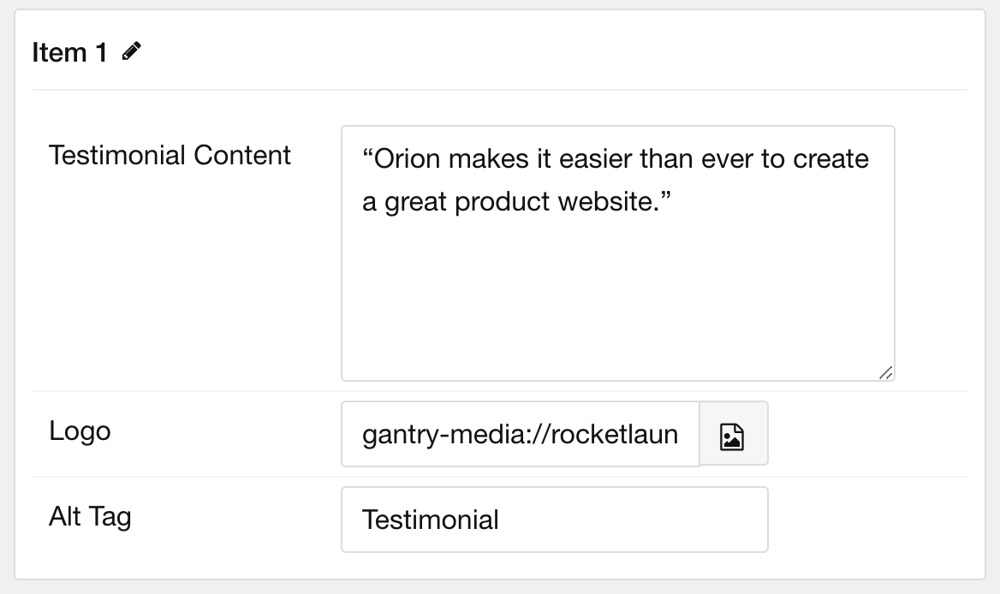
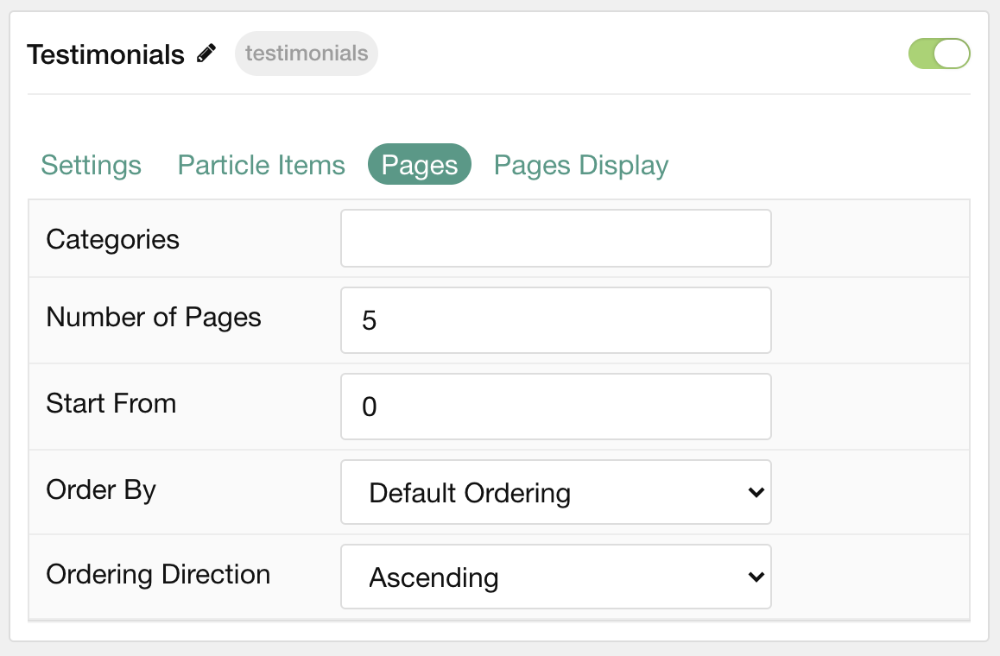
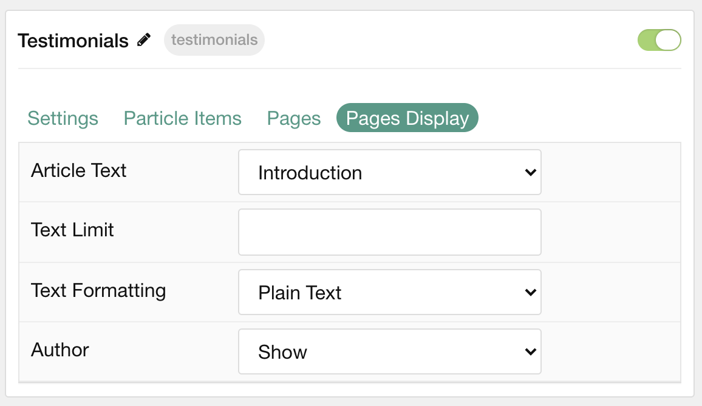

## Introduction

The **Testimonials** particle creates a grid of testimonials, including text content, logo, and alt text.

Here are the topics covered in this guide:

* [Configuration](#configuration)
    - [Main Options](#main-options)
    - [Item Options](#item-options)
    - [Articles](#articles)
    - [Display](#display)

## Configuration

### Main Options 

These options affect the main area of the particle, and not the individual items within. You can set the title of the particle, as well as give it an introductory paragraph here.

| Option        | Description                                                                     |
| :-----        | :-----                                                                          |
| Particle Name | Give the particle a name. This only appears on the backend.                     |
| CSS Classes   | Set the CSS class(es) you would like to have apply at the particle level.       |
| Title         | Enter the title of the particle you would like to have appear on the front end. |
| Grid Column   | Set the number of columns you want items to appear in.                          |

### Item Options

These items make up the individual featured items in the particle. They sit apart from the particle's title and introduction. Each item can have its own properties, including icons and written content.

| Option              | Description                                                            |
| :-----              | :-----                                                                 |
| Testimonial Content | Enter text content that makes up the quote or body of the testimonial. |
| Logo                | Enter a logo to serve as the author.                                   |
| Alt Tag             | Enter alt text for the logo.                                           |

### Articles

| Option             | Description                                                                            |
| :-----             | :-----                                                                                 |
| Categories         | Select the categories of pages this particle will display.                             |
| Number of Pages    | Enter the maximum number of pages to display.                                          |
| Start From         | Enter offset specifying the first page to return. The default is '0' (the first page). |
| Order By           | Choose the type of factor to order by.                                                 |
| Ordering Direction | Choose between **Ascending** and **Descending** as the page ordering method.           |

### Display

This section configures how articles are displayed.

| Option          | Description                                                                                        |
| :-----------    | :------------------------------------------------------------------------------------------------- |
| Article Text    | Select the article text to appear in each item.                                                    |
| Text Limit      | Set a limit (in characters) of article text to appear in the item.                                 |
| Text Formatting | Choose to display **Plain Text** or **HTML** in the article text.                                  |
| Author          | **Show** or **Hide** the Author information.                                                       |
