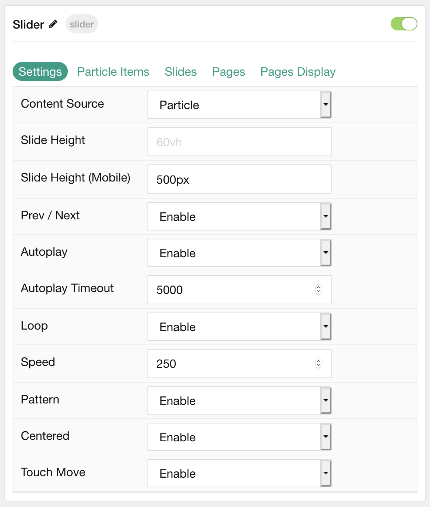
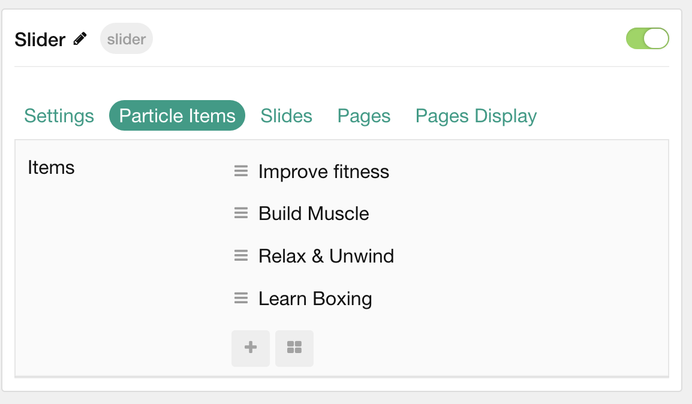
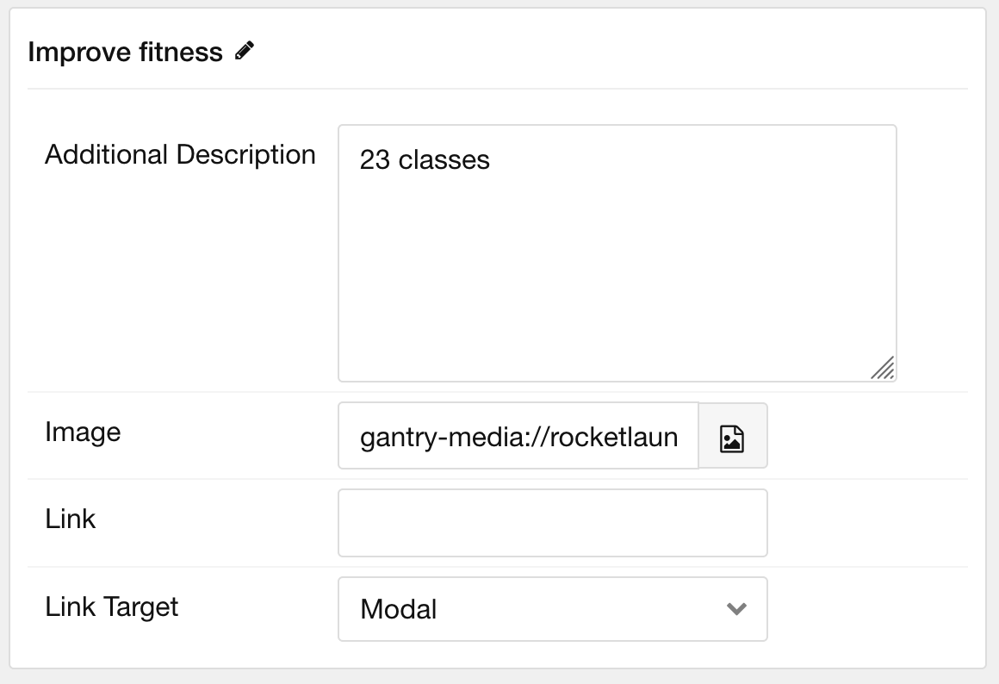
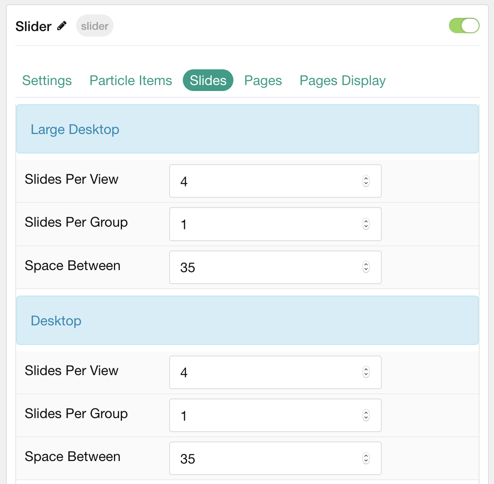
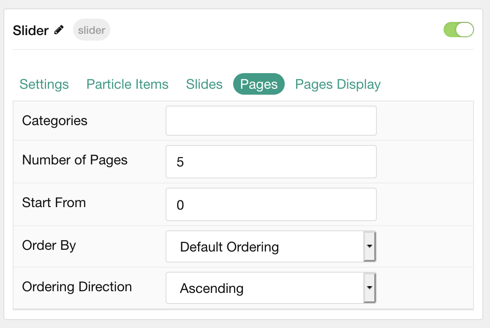
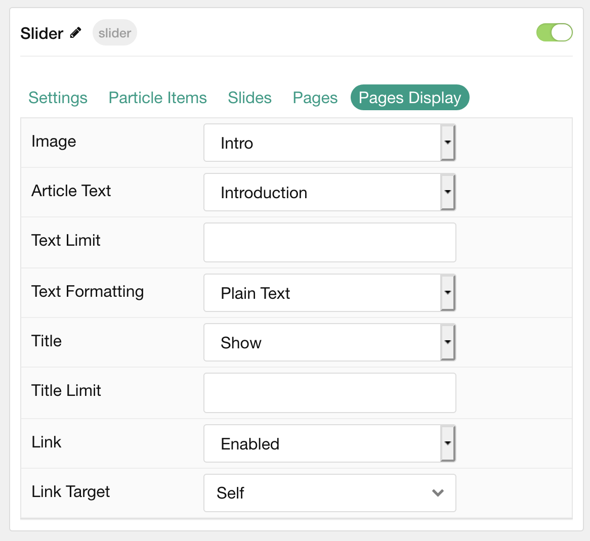

## Introduction

The **Slider** particle is a great way to display images in your website.

Here are the topics covered in this guide:

* [Configuration](#configuration)
    - [Main Options](#settings)
    - [Item Options](#particle-item-options)
    - [Slides](#slides)
    - [Pages](#pages)
    - [Display](#display)

## Configuration

### Settings 

These options affect the main area of the particle, and not the individual items within.

| Option                | Description                                                                                         |
| :-----                | :-----                                                                                              |
| Particle Name         | This is the name of the particle used for back end management. It does not appear on the front end. |
| Content Source        | Choose between **Particle** and **Grav** as the Content Source.                                |
| Slide Height          | Enter the desired slide height.                                                                     |
| Slide Height (Mobile) | Enter the desired slide height on mobile devices.                                                   |
| Prev / Next           | Choose to **Enable** or **Disable** the prev / next navigation.                                     |
| Autoplay              | Choose to **Enable** or **Disable** autoplay.                                                       |
| Autoplay Timeout      | Enter the desired time between each transition during autoplay.                                     |
| Loop                  | Choose to **Enable** or **Disable** looping.                                                        |
| Speed                 | Enter the desired transition speed between slides.                                                  |
| Pattern               | Choose to **Enable** or **Disable** the pattern.                                                    |
| Centered              | Choose to **Enable** or **Disable** centered slides.                                                |
| Touch Move            | Choose to **Enable** or **Disable** touch-based control of slide movements.                         |

### Particle Item Options

These items make up the individual featured items in the particle. Items in this section will only appear if **Particle** is selected as the **Content Source**.

| Option                 | Description                                                      |
| :-----                 | :-----                                                           |
| Item Name              | This is the name of the item. This only appears in the back end. |
| Additional Description | Enter a text description to add to the item.                     |
| Icon                   | Select a Font Awesome icon for the item.                         |
| Image                  | Select an image to appear in the slide.                          |
| Link                   | Enter a URL you would like the item to link to.                  |
| Link Target            | Choose the target tab you would like the URL to open to.         |

### Slides

The **Slides** tab gives you control over how many slides appear for different experiences. It also includes control over the spacing between slides.

| Option           | Description                                    |
| :-----           | :-----                                         |
| Slides Per View  | Select a number of slides to appear per view.  |
| Slides Per Group | Select a number of slides to appear per group. |
| Space Between    | Enter a space (in px) to exist between slides. |

### Pages

| Option             | Description                                                                            |
| :-----             | :-----                                                                                 |
| Categories         | Select the categories of pages this particle will display.                             |
| Number of Pages    | Enter the maximum number of pages to display.                                          |
| Start From         | Enter offset specifying the first page to return. The default is '0' (the first page). |
| Order By           | Choose the type of factor to order by.                                                 |
| Ordering Direction | Choose between **Ascending** and **Descending** as the page ordering method.           |

### Display

This section configures how pages are displayed.

| Option          | Description                                                                                             |
| :-----          | :-----                                                                                                  |
| Image           | Choose to **Show** or **Hide** the page's image.                                                        |
| Article Text    | Choose between **Introduction** or **Full Article** as the content type. You can also **Hide** content. |
| Text Limit      | Enter a character limit for page's content displayed in this particle.                                  |
| Text Formatting | Choose between **Plain Text** and **HTML** for the page's content to be displayed in.                   |
| Title           | Choose to **Show** or **Hide** the page's title.                                                        |
| Title Limit     | Enter a character limit for page's title displayed in this particle.                                    |
| Link            | Choose to **Enable** or **Disable** the page's link.                                                    |
| Link Target     | Choose which window/tab the link opens to.                                                              |
