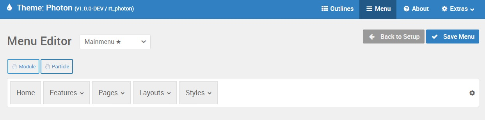

Introduction
-----

Recreating features of the demo site used to show off some of the more interesting aspects of Photon can be done fairly easily. All you settings, and you should be able to reproduce most (if not all) of the elements found in our demo site.

Below, we will break down some of these elements and give you the information you need to know to recreate them on your own site using the Photon Theme.

Keep in mind that a lot of the detail that makes our demos look so good is the result of many hours of hard work by our team, and some of them will require a moderate level of experience working with the Grav back end. We have added most of these elements into the theme's core files in order to make them easily accessible without having to edit any code.

>> NOTE: We recommend downloading a copy of the RocketLauncher whenever you are attempting to replicate demo content. This allows easy referencing, whether on your site in a subdirectory, development server, or on a localhost. This will allow you to see all of our demo content in context, making it easier to replicate.

Home Particles
-----

Here is a list of particles that are available in Photon, as well as links to documentation to help you get started:

:   1. **Navigation** Logo / Image (Particle) [1%, 8%, se]
    2. **Navigation** Menu (Particle) [1%, 25%, se]
    3. **Navigation** Social (Particle) [1%, 85%, se]
    4. **Slideshow** News Slider (Particle) [5%, 8%, se]
    5. **Header** Image Grid (Particle) [25%, 8%, se]
    6. **Header** Pricing Table (Particle) [25%, 65% se]
    8. **Showcase** Accordion (Particle) [38%, 8%, se]
    8. **Showcase** Custom HTML (Particle) [38%, 65%, se]
    9. **Showcase** Grid Content (Particle) [44%, 65%, se]
    10. **Expanded** Content Tabs (Particle) [59%, 8%, se]
    11. **Expanded** Owl Carousel (Particle) [59%, 65%, se]
    12. **Expanded** Simple Content (Particle) [70%, 66%, se]
    13. **Widget** Owl Carousel (Particle) [81%, 8%, se]
    14. **Copyright** Logo / Image (Particle) [93%, 8%, se]
    15. **Copyright** Newsletter (Particle) [93%, 60%, se]
    16. **Copyright** Copyright (Particle) [96%, 8%, se]
    17. **Copyright** Custom HTML (Particle) [96%, 60%, se]

We have detailed how to recreate the individual particles pictured above in the links below, separated by sections found in the **Layout Manager**.

1. [Navigation](demo_navigation.md)
2. [Slideshow](demo_slideshow.md)
3. [Header](demo_header.md)
4. [Showcase](demo_showcase.md)
5. [Expanded](demo_expanded.md)
6. [Widget](demo_widget.md)
7. [Copyright](demo_copyright.md)

Not pictured here is an **Offcanvas** position which hosts the mobile menu. You can find out more about the Offcanvas position in the [Gantry 5 documentation](http://docs.gantry.org/gantry5/configure/layout-manager#offcanvas-section).

Recreating the Front Page
-----

The front page of the Photon demo sits apart from the rest of the page layouts in that it features the latest and greatest features of the theme. It is because of this that several layout overrides were done. In this section, we will break down the settings you will need to recreate elements present in the front page of the Photon demo.

Home Page Layout Presets
-----

We have included a layout preset for the home page within the theme if needed. The **Home - Particles** preset includes all of the particle-based home page demo content so you can hit the ground running with a copy of our demo to work from loaded directly into the layout.

You can access the presets by selecting **Load** in the **Layout Manager**.

Menu Editor
-----

Photon has its own built-in Menu Editor which takes full advantage of Grav's menu system, taking your Grav menus and enhancing them before passing them to visitors on the front end. Any changes made in the Menu Editor will only affect the way it appears to the visitor, and not the way Grav sees or uses it.

You can access the Gantry Menu Editor by navigating to **Admin > Gantry 5 > Menu**. You can find out more about navigating and using the Gantry Menu Editor [in our documentation](http://docs.gantry.org/gantry5/configure/menu-editor).

Assignments
-----

Assignments are also managed in the Gantry Administrator. This administrative panel enables you to assign theme outlines to specific menu items, pages, and other areas of your site. By navigating to **Admin > Gantry 5** and selecting an outline other than the **Base Outline**, you will be able to assign that outline by navigating to the **Assignments** panel. Simply switch any menu items to on (green) that you want to assign that outline to. In the case of the Home page, this would be your default Home page in your default (main) menu.
