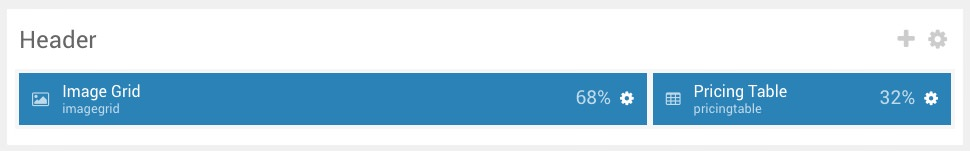
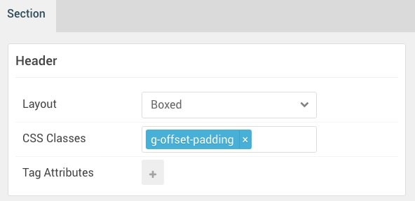

## Introduction

:	1. **Image Grid** [10%, 3%, se]
	2. **Pricing Table** [10%, 70%, se]

The **Header** section includes two particles assigned to the **header-a** and **header-b** widget positions.

Here is a breakdown of the widget(s) and particle(s) that appear in this section:

* [Image Grid (particle)](#image-grid-(particle))
* [Pricing Table (particle)](#pricing-grid-(particle))

## Section Settings

| Option           | Setting            |
| :--------------- | :----------        |
| Layout           | Boxed              |
| CSS Classes      | `g-offset-padding` |
| Tag Attributes   | Blank              |

## Image Grid (Particle)

### Particle Settings

| Option             | Setting                                                                      |
| :-----             | :-----                                                                       |
| Particle Name      | `Image Grid`                                                                 |
| CSS Classes        | Blank                                                                        |
| Title              | `Photo Gallery`                                                              |
| Description        | `Using the power of Gantry 5 Particles to create a customizable image grid.` |
| Grid Columns       | 5 Columns                                                                    |
| Album Name         | Blank                                                                        |
| Item 1 Name        | `New Item`                                                                   |
| Item 1 Promo Image | Custom                                                                       |
| Item 1 Caption     | Blank                                                                        |

### Block Settings

| Option         | Setting   |
| :-----         | :-----    |
| CSS ID         | Blank     |
| CSS Classes    | Blank     |
| Variations     | Blank     |
| Tag Attributes | Blank     |
| Fixed Size     | Unchecked |
| Block Size     | `68%`     |

## Pricing Table (Particle)

### Particle Settings

| Option                 | Setting                |
| :-----                 | :-----                 |
| Particle Name          | `Pricing Table`        |
| CSS Classes            | Blank                  |
| Title                  | Blank                  |
| Header Text            | Blank                  |
| Footer Text            | Blank                  |
| Grid Column            | 1 Column               |
| Item 1 Name            | `Free`                 |
| Item 1 Accent Color    | Accent Color 1         |
| Item 1 Custom Color    | Blank                  |
| Item 1 CSS Classes     | Blank                  |
| Item 1 Ribbon Text     | Blank                  |
| Item 1 Icon            | Blank                  |
| Item 1 Price           | `0.00 €`               |
| Item 1 Period          | `/mo`                  |
| Item 1 Description     | Blank                  |
| Item 1 Button Label    | `Get For Free`         |
| Item 1 Button Link     | `#`                    |
| Item 1 Button Classes  | Blank                  |
| Subitem 1 Name         | `News Slider Particle` |
| Subitem 1 Text         | `News Slider Particle` |
| Subitem 1 Item Classes | Blank                  |

### Block Settings

| Option         | Setting                  |
| :-----         | :-----                   |
| CSS ID         | Blank                    |
| CSS Classes    | Blank                    |
| Variations     | `No Margin` `No Padding` |
| Tag Attributes | Blank                    |
| Fixed Size     | Unchecked                |
| Block Size     | `32%`                    |

