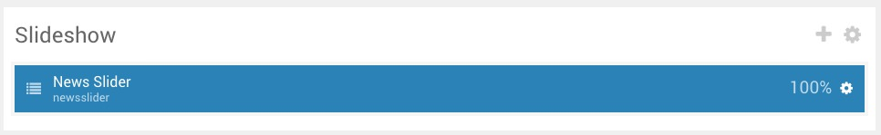
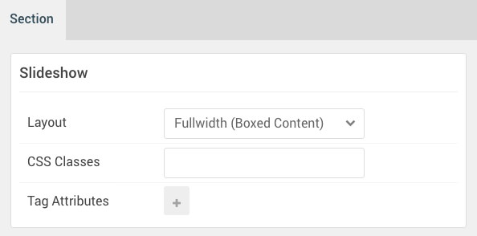

## Introduction

The **Slideshow** section includes one **News Slider** particle. 

Here is a breakdown of the widget(s) and particle(s) that appear in this section:

* [News Slider (particle)](#news-slider-(particle))

## Section Settings

| Option           | Setting                     |
| :--------------- | :----------                 |
| Layout           | Fullwidth (Flushed Content) |
| CSS Classes      | Blank                       |
| Tag Attributes   | Blank                       |

## News Slider (Particle)

### Particle Settings

| Option                  | Setting                               |
| :-----                  | :-----                                |
| Particle Name           | `News Slider`                         |
| Autoplay                | Enable                                |
| Autoplay Delay          | `5000`                                |
| CSS Classes             | `g-bottom-offset`                     |
| Title                   | Blank                                 |
| Item 1 Name             | `Corporate & Business Oriented Theme` |
| Item 1 Background Image | Custom                                |
| Item 1 Description      | Blank                                 |
| Item 1 Button Label     | `Read More`                           |
| Item 1 Button Link      | `#`                                   |
| Target                  | Self                                  |
| Button Class            | Blank                                 |

### Block Settings

| Option         | Setting                            |
| :-----         | :-----                             |
| CSS ID         | Blank                              |
| CSS Classes    | `nomarginbottom` `nopaddingbottom` |
| Variations     | Blank                              |
| Tag Attributes | Blank                              |
| Fixed Size     | Unchecked                          |
| Block Size     | `100%`                             |
