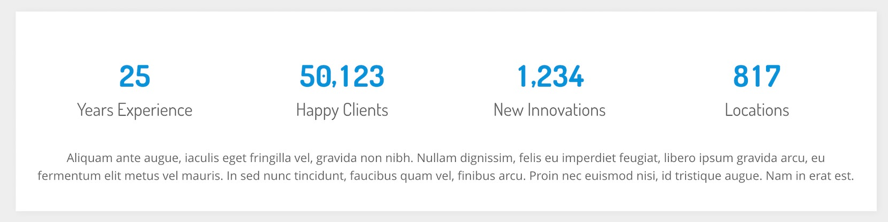
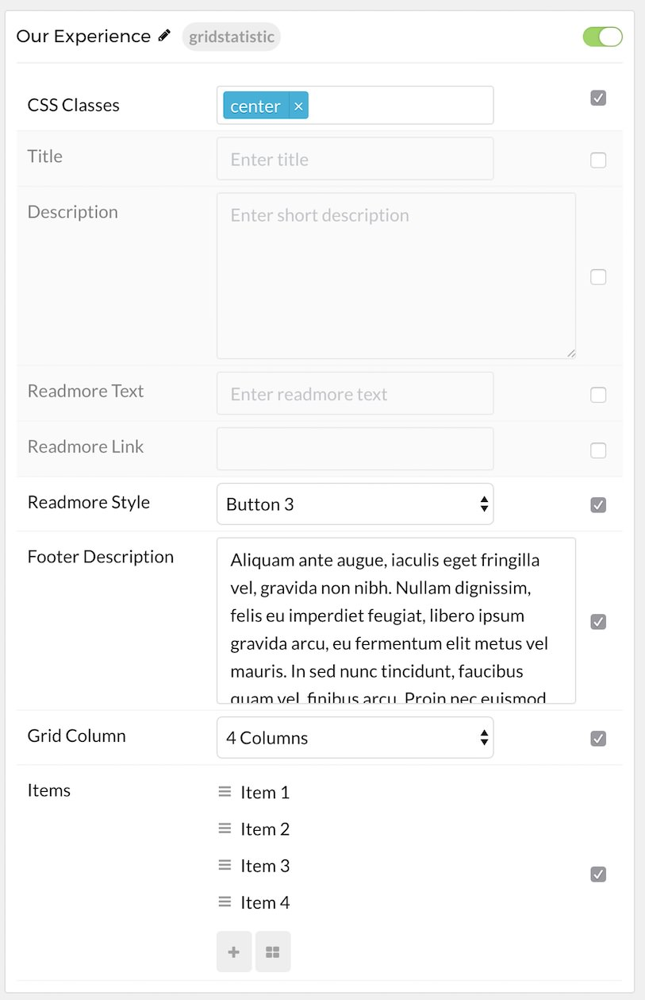
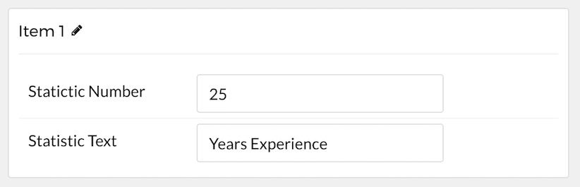

## Introduction

The **Grid Statistic** particle enables you to display animated, well-organized numbers and statistics on your site.

Here are the topics covered in this guide:

* [Configuration](#configuration)
    - [Main Options](#main-options)
    - [Item Options](#item-options)

## Configuration

### Main Options 

These options affect the main area of the particle, and not the individual items within. For example, if you want to display content that includes a title, headline, image, and link you can do so here, but if you want to display numerous individual items, each with their own text, images, and/or links, you can do so using the **Block Items** collection feature.

| Option             | Description                                                                                 |
| :-----             | :-----                                                                                      |
| Particle Name      | Enter the name you would like to assign to the particle. This only appears in the back end. |
| CSS Classes        | Enter the CSS class(es) you want to use in the content of the particle.                     |
| Title              | Enter the title of the particle, as it will appear on the front end.                        |
| Description        | Enter a description you would like to have appear on the front end.                         |
| Readmore Text      | Enter text that will appears as the readmore link for the particle.                         |
| Readmore Link      | Add the link you would like the readmore text to go to.                                     |
| Readmore Style     | Enter any CSS class(es) you would like to have apply to the readmore link.                  |
| Footer Description | Enter a description you would like to have appear at the bottom of the particle.            |
| Grid Column        | Set the number of columns items will be presented in on the front end.                      |

### Item Options

These items make up the individual featured items in the particle.

| Option           | Description                                                                             |
| :-----           | :-----                                                                                  |
| Item Name        | Enter the name you would like to assign to the item. This only appears in the back end. |
| Statictic Number | Set the number you would like to have displayed in the item.                            |
| Statistic Text   | Add text to describe your statistic item.                                               |
